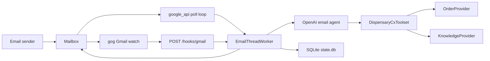

# Canna Mailroom

Local-first, email-native dispensary CX agent runtime.

Canna Mailroom treats each email thread as a session, keeps continuity with the OpenAI Responses API, and sends replies back into the same thread. The customer-facing agent is intentionally narrow: it can only call two read-only tools.

- `lookup_order`
- `search_store_knowledge`

The tool contracts stay stable across dispensaries. Real store differences are handled behind provider adapters.

## What It Is Now

- A provider-agnostic CX email runtime for dispensaries
- One mailbox per runtime, one active process per mailbox
- Two mailbox harnesses:
  - `google_api`: direct Gmail polling
  - `gog`: `gog`-managed Gmail watch/send with hook ingress
- Pluggable order lookup:
  - `manual`
  - `dutchie`
  - `custom` via Python import path
- Manual store knowledge backed by JSON

## What The Agent Can Do

- Answer order-status questions when it has an order number
- Answer store-owned FAQ and policy questions about:
  - hours
  - payments
  - pickup
  - delivery
  - ID requirements
  - cancellation and refund guidance
  - store contact details

## What The Agent Will Not Do

- browse the public web for customer replies
- edit or cancel orders
- promise refunds
- recommend cannabis products or dosing
- browse Gmail directly as a tool
- ingest attachments

## How It Works



## Quickstart

Use the simplest path first: `google_api` plus the built-in sample data.

1. Create a Python 3.11 virtual environment and install the package.

```bash
make setup
source .venv/bin/activate
```

2. Run the setup wizard.

```bash
mailroom setup
```

Recommended first-run choices:
- `MAIL_PROVIDER=google_api`
- `ORDER_PROVIDER=manual`
- `KNOWLEDGE_PROVIDER=manual`
- keep the default sample JSON paths unless you already have real store data
- use `SENDER_POLICY_MODE=allowlist` while testing

3. Run local checks.

```bash
mailroom doctor
python3.11 -m unittest discover -s tests
```

4. Start the app.

```bash
mailroom run --reload
```

5. Check health.

```bash
curl http://127.0.0.1:8787/healthz
```

6. Send a test email to `AGENT_EMAIL` from another mailbox and reply in the same thread to verify continuity.

If you want hook-based ingress instead, rerun `mailroom connections` and choose `MAIL_PROVIDER=gog`.

## Provider Surface

### Stable model tools

- `lookup_order(order_number, customer_email?, phone_last4?)`
- `search_store_knowledge(question, location_hint?)`

### Built-in providers

- `ManualKnowledgeProvider`
  - reads `STORE_KNOWLEDGE_FILE`
- `ManualOrderProvider`
  - reads `MANUAL_ORDER_FILE`
- `DutchieOrderProvider`
  - uses `DUTCHIE_LOCATION_KEY`
  - optionally uses `DUTCHIE_INTEGRATOR_KEY`
  - uses `DUTCHIE_API_BASE_URL`

### Custom order providers

Set:

```bash
ORDER_PROVIDER=custom
ORDER_PROVIDER_FACTORY=your_module:build_provider
```

Your factory should return an object with:

```python
def lookup(order_number: str, *, customer_email: str | None = None, phone_last4: str | None = None):
    ...
```

## Sample Data Files

The repo ships with starter files:

- `./examples/store_knowledge.sample.json`
- `./examples/manual_orders.sample.json`

These are meant for demos and local development. Real deployments should replace them with store-owned data.

## Key Commands

```bash
mailroom setup
mailroom connections
mailroom access
mailroom doctor
mailroom auth
mailroom run --reload

curl http://127.0.0.1:8787/healthz
curl -X POST http://127.0.0.1:8787/process-now
curl http://127.0.0.1:8787/dead-letter
curl -X POST "http://127.0.0.1:8787/dead-letter/requeue/<message_id>?process_now=true"
```

## Repo Map

- `app/main.py`: FastAPI lifecycle, provider selection, and operator endpoints
- `app/ai_agent.py`: OpenAI Responses API calls and tool loop
- `app/cx_toolset.py`: stable two-tool CX surface
- `app/cx_providers.py`: provider interfaces, manual providers, Dutchie adapter, and custom loader
- `app/gmail_worker.py`: provider-agnostic email processing, retries, dead-letter handling
- `app/state.py`: SQLite schema and state access layer
- `app/settings.py`: environment-driven configuration
- `SYSTEM_PROMPT.md`: customer-service prompt and guardrails
- `examples/`: sample knowledge and manual order files

## Current Boundaries

- no manual approval before outbound send
- no denylist or richer sender rules beyond allowlist mode
- no attachment handling
- no multi-instance coordination
- no inventory search or product recommendation flow
- no refund, cancellation, or order-edit execution

## Documentation

- [docs/architecture.md](docs/architecture.md)
- [docs/security-and-safety.md](docs/security-and-safety.md)
- [docs/testing-and-quality.md](docs/testing-and-quality.md)
- [docs/faq.md](docs/faq.md)
