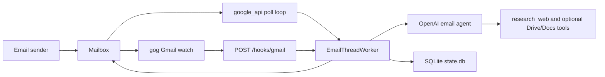

# Canna Mailroom

_Last verified against commit `b6c46e6`._

Canna Mailroom is a local-first, email-native AI agent runtime. It treats each email thread as a session, calls the OpenAI Responses API to generate replies, and sends those replies back into the same thread.

The runtime now has two mailbox harnesses:
- `google_api`: direct Gmail polling plus native Drive and Docs tools
- `gog`: `gog`-managed Gmail watch/send with hook ingress; email-only plus `research_web`

## Who It Is For

- Developers proving out an email-native agent before building a larger product shell
- Operators running one dedicated mailbox on one host
- Stakeholders evaluating the value and boundaries of a “reply by email” agent

## What It Does Today

- Monitors one mailbox
- Keeps per-thread continuity using the last OpenAI `response.id`
- Retries transient failures with backoff
- Dead-letters exhausted failures for replay
- Exposes health, dead-letter, and replay endpoints
- Supports two ingress models:
  - polling via Gmail API
  - hook delivery via `gog gmail watch serve`

## Runtime Modes

| Mode | What it uses | Best fit | Current limits |
|---|---|---|---|
| `google_api` | local Google OAuth files plus Gmail/Drive/Docs APIs | simplest local bring-up | still requires Google OAuth setup |
| `gog` | external `gog` CLI for Gmail watch/send | server-style Gmail harness with hook ingress | still requires one deployer-owned GCP project and public HTTPS push delivery |

## How It Works



## 5-Minute Quickstart

Use the simplest path first: `google_api`.

1. Create a Python 3.11 virtual environment and install the package.

   ```bash
   make setup
   source .venv/bin/activate
   ```

2. Run the interactive wizard.

   ```bash
   mailroom setup
   ```

   For the quickest local test:
   - choose `MAIL_PROVIDER=google_api`
   - enter a real agent mailbox address
   - complete the one-time Google OAuth flow

3. Run the local checks.

   ```bash
   mailroom doctor
   ```

4. Start the service.

   ```bash
   mailroom run --reload
   ```

5. Check health.

   ```bash
   curl http://127.0.0.1:8787/healthz
   ```

6. Send an email to `AGENT_EMAIL` from a different mailbox and wait for the reply. Reply again in the same thread to verify continuity.

If you want hook-based ingress instead, rerun `mailroom connections` and choose `MAIL_PROVIDER=gog`.

## Key Commands

```bash
make setup
make wizard
make connections
make auth
make doctor
make run

mailroom setup
mailroom connections
mailroom doctor
mailroom auth
mailroom run --reload

curl http://127.0.0.1:8787/healthz
curl -X POST http://127.0.0.1:8787/process-now
curl http://127.0.0.1:8787/dead-letter
curl -X POST "http://127.0.0.1:8787/dead-letter/requeue/<message_id>?process_now=true"
```

## Current Boundaries

This repo is still an MVP. It does not currently provide:
- a human approval gate before sending
- sender allowlists or policy rules
- multi-instance coordination
- multi-mailbox orchestration
- attachment ingestion
- a real automated test suite

Important runtime boundary:
- Drive and Docs tools are available only in `google_api` mode
- `gog` mode is email-only plus `research_web`

## Repo Map

- `app/main.py`: FastAPI lifecycle, provider selection, and operator endpoints
- `app/cli.py`: first-party CLI with setup, connections, doctor, auth, and run commands
- `app/mailbox.py`: mailbox provider interface and message snapshot types
- `app/google_mailbox.py`: Gmail API-backed mailbox provider
- `app/gog_mailbox.py`: `gog`-backed send provider
- `app/gog_watcher.py`: `gog gmail watch start/serve` manager
- `app/gmail_worker.py`: provider-agnostic email processing, retries, dead-letter handling
- `app/ai_agent.py`: OpenAI Responses API calls and tool loop
- `app/tools.py`: Drive and Docs actions for `google_api` mode
- `app/state.py`: SQLite schema and state access layer
- `app/google_clients.py`: OAuth and Google API client creation for `google_api` mode
- `app/settings.py`: environment-driven configuration
- `SYSTEM_PROMPT.md`: default agent persona and behavioral rules

## Documentation

Start here:
- [docs/index.md](docs/index.md)
- [docs/architecture.md](docs/architecture.md)
- [docs/runtime-and-pipeline.md](docs/runtime-and-pipeline.md)
- [docs/operations.md](docs/operations.md)

Full set:
- [docs/index.md](docs/index.md)
- [docs/architecture.md](docs/architecture.md)
- [docs/data-model.md](docs/data-model.md)
- [docs/runtime-and-pipeline.md](docs/runtime-and-pipeline.md)
- [docs/cli-reference.md](docs/cli-reference.md)
- [docs/operations.md](docs/operations.md)
- [docs/deployment.md](docs/deployment.md)
- [docs/security-and-safety.md](docs/security-and-safety.md)
- [docs/testing-and-quality.md](docs/testing-and-quality.md)
- [docs/faq.md](docs/faq.md)
- [docs/adr/](docs/adr)

## Project Hygiene

- License: [MIT](LICENSE)
- Contribution guide: [CONTRIBUTING.md](CONTRIBUTING.md)
- Code of conduct: [CODE_OF_CONDUCT.md](CODE_OF_CONDUCT.md)
- Security policy: [SECURITY.md](SECURITY.md)
- CI: GitHub Actions compile check in `.github/workflows/ci.yml`
