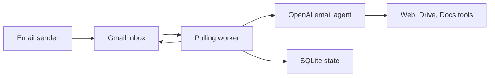

# Canna Mailroom

_Last verified against commit `b09c4f1`._

Canna Mailroom is a local-first, email-native AI agent runtime. It watches a Gmail inbox, treats each Gmail thread as a session, calls the OpenAI Responses API to generate replies, and sends those replies back into the same Gmail thread.

The current implementation is intentionally small:
- one FastAPI process
- one background polling worker
- one local SQLite state store
- one Gmail mailbox

It can also use a small tool set while composing replies:
- `research_web`
- `list_drive_files`
- `create_google_doc`
- `append_google_doc`
- `read_google_doc`

## Who It Is For

- Developers validating an email-agent MVP without building queueing and webhook infrastructure first
- Operators running a single mailbox-backed automation service
- Stakeholders evaluating the value and boundaries of “AI over email threads”

## What It Does Today

- Polls Gmail with `is:unread -from:me`
- Extracts plain-text message content and removes common quoted-reply blocks
- Keeps per-thread continuity using `previous_response_id`
- Lets the model research the public web and use Google Drive and Google Docs tools
- Retries transient failures with backoff
- Dead-letters exhausted or non-transient failures for operator replay
- Exposes health and recovery endpoints for operators

## How It Works



## 5-Minute Quickstart

1. Create a virtual environment and install the package.

   ```bash
   python3 -m venv .venv
   source .venv/bin/activate
   pip install -e .
   cp .env.example .env
   ```

2. Edit `.env` and set the required values.

   Required:
   - `OPENAI_API_KEY`
   - `AGENT_EMAIL`

   Useful defaults are already provided for:
   - `OPENAI_MODEL`
   - `POLL_SECONDS`
   - `STATE_DB`
   - `GOOGLE_TOKEN_FILE`
   - `GOOGLE_CREDENTIALS_FILE`
   - `GOOGLE_DRIVE_DEFAULT_FOLDER_ID`
   - `SYSTEM_PROMPT_FILE`
   - retry settings

3. Place your Google OAuth desktop client file at the repo root as `credentials.json`.

4. Run the Google OAuth flow once to create `token.json`.

   ```bash
   make auth
   ```

5. Start the service.

   ```bash
   make run
   ```

6. Check service and worker health.

   ```bash
   curl http://127.0.0.1:8787/healthz
   ```

7. Send an email to `AGENT_EMAIL`. Reply in the same thread to confirm context continuity.

## Key Commands

```bash
make setup
make auth
make run

curl http://127.0.0.1:8787/healthz
curl -X POST http://127.0.0.1:8787/process-now
curl http://127.0.0.1:8787/dead-letter
curl -X POST "http://127.0.0.1:8787/dead-letter/requeue/<message_id>?process_now=true"
```

## Current Boundaries

This repo is an MVP. The code does not currently provide:
- a human approval gate before sending mail
- a sender allowlist or denylist
- multi-instance coordination
- webhook-driven Gmail ingestion
- a full automated test suite

Use a dedicated mailbox and a low-risk environment.

## Repo Map

- `app/main.py`: FastAPI lifecycle and operator endpoints
- `app/gmail_worker.py`: Gmail poll loop, retries, send path, dead-letter handling
- `app/ai_agent.py`: OpenAI Responses API calls and tool loop
- `app/tools.py`: Google Drive and Google Docs actions
- `app/state.py`: SQLite schema and state access layer
- `app/google_clients.py`: OAuth and Google API client creation
- `app/settings.py`: environment-driven configuration
- `SYSTEM_PROMPT.md`: default agent persona and behavioral rules

## Documentation

Start here:
- [docs/index.md](docs/index.md)
- [docs/architecture.md](docs/architecture.md)
- [docs/runtime-and-pipeline.md](docs/runtime-and-pipeline.md)
- [docs/operations.md](docs/operations.md)

Full set:
- [docs/index.md](docs/index.md)
- [docs/architecture.md](docs/architecture.md)
- [docs/data-model.md](docs/data-model.md)
- [docs/runtime-and-pipeline.md](docs/runtime-and-pipeline.md)
- [docs/cli-reference.md](docs/cli-reference.md)
- [docs/operations.md](docs/operations.md)
- [docs/deployment.md](docs/deployment.md)
- [docs/security-and-safety.md](docs/security-and-safety.md)
- [docs/testing-and-quality.md](docs/testing-and-quality.md)
- [docs/faq.md](docs/faq.md)
- [docs/adr/](docs/adr)

## Project Hygiene

- License: [MIT](LICENSE)
- Contribution guide: [CONTRIBUTING.md](CONTRIBUTING.md)
- Code of conduct: [CODE_OF_CONDUCT.md](CODE_OF_CONDUCT.md)
- Security policy: [SECURITY.md](SECURITY.md)
- CI: GitHub Actions compile check in `.github/workflows/ci.yml`
