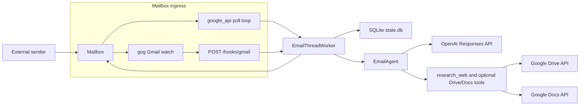
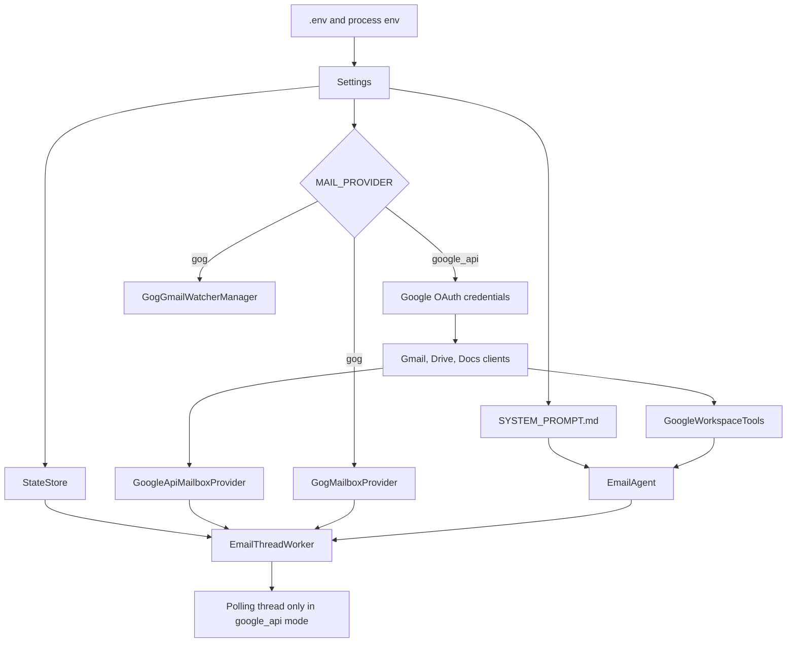
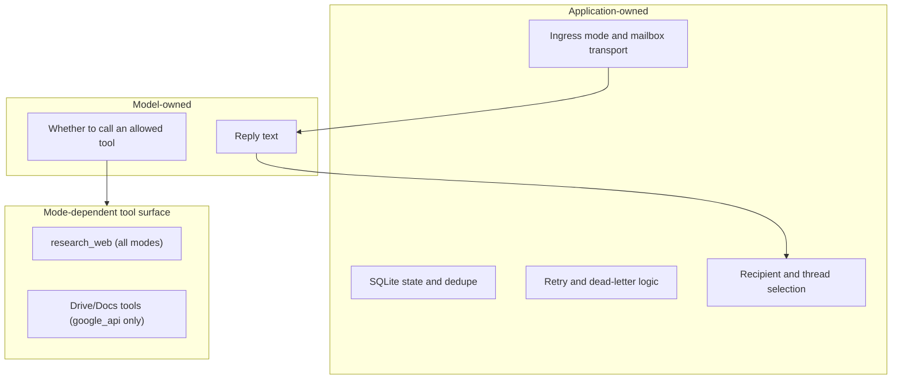

# Architecture

_Last verified against commit `b6c46e6`._

## System Overview

Canna Mailroom is a single-process FastAPI application with a provider-selected mailbox harness.

- In `google_api` mode, startup builds Gmail, Drive, and Docs clients, then starts a background polling thread.
- In `gog` mode, startup builds a `gog` watcher manager, exposes `POST /hooks/gmail`, and processes hook-delivered messages through the same worker core.

The agent itself stays the same in both modes:
- inbound email becomes a normalized `MailboxMessage`
- the worker restores thread continuity from SQLite
- the agent generates a reply through the OpenAI Responses API
- the worker sends the reply through the selected mailbox provider

## Runtime Topology

## Startup Sequence

## Component Responsibilities

| Component | File | Responsibility | Notes |
|---|---|---|---|
| FastAPI app | `app/main.py` | startup orchestration and operator endpoints | Exposes `/healthz`, `/process-now`, `/dead-letter`, `/dead-letter/requeue/{message_id}`, and `/hooks/gmail` |
| Settings loader | `app/settings.py` | environment-driven configuration | Includes provider selection and `gog` watcher settings |
| Mailbox boundary | `app/mailbox.py` | normalized mailbox message model and provider protocol | Decouples agent runtime from Gmail transport details |
| Gmail API provider | `app/google_mailbox.py` | Gmail read, send, thread scan, mark-read, dead-letter context | Used only in `google_api` mode |
| `gog` send provider | `app/gog_mailbox.py` | outbound reply send via `gog gmail send` | Used only in `gog` mode |
| `gog` watcher manager | `app/gog_watcher.py` | `gog gmail watch start/serve` lifecycle | Runs watch renewals and restarts the serve subprocess |
| Google client factory | `app/google_clients.py` | OAuth bootstrap, token refresh, API client creation | Used only in `google_api` mode |
| State store | `app/state.py` | SQLite schema creation and state access | Persists thread pointers, inbound snapshots, dedupe, dead letters, and reply tracking |
| Email agent | `app/ai_agent.py` | OpenAI Responses API calls and tool loop | In `gog` mode, only `research_web` is exposed |
| Workspace tools | `app/tools.py` | Drive and Docs side effects | Instantiated only in `google_api` mode |
| Email worker | `app/gmail_worker.py` | provider-agnostic processing, retries, dead-lettering, send path | Accepts either polled IDs or hook-delivered `MailboxMessage` objects |

## Ownership Boundaries

| Concern | Owned by | Evidence in code |
|---|---|---|
| Which mailbox transport is active | application | `MAIL_PROVIDER` in `app/settings.py`, branch in `app/main.py` |
| Whether ingress is polling or hook-based | application | `app/main.py` startup and `/hooks/gmail` |
| Which message gets processed | application | `EmailThreadWorker.process_once()` or `/hooks/gmail` payload parsing |
| Which thread/session is used | application | `thread_id` plus `StateStore.get_last_response_id()` |
| Which recipient gets the reply | application | worker parses the inbound `From` header |
| Reply body and tool usage | model | `EmailAgent.respond_in_thread()` |
| Which tools are available | application | `EmailAgent._tool_specs()` and whether `tools` is `None` |
| Retry timing and dead-lettering | application | `EmailThreadWorker._process_message_with_retry()` |

## Tooling Boundaries

| Runtime mode | Tool surface | Notes |
|---|---|---|
| `google_api` | `research_web`, `list_drive_files`, `create_google_doc`, `append_google_doc`, `read_google_doc` | `GoogleWorkspaceTools` is constructed at startup |
| `gog` | `research_web` only | `tools=None`, so Drive and Docs actions are intentionally unavailable |

No mode exposes Gmail read or send as model-callable tools. Email transport stays application-owned.

## Key Constraints

- single mailbox per runtime
- single active process per mailbox
- local SQLite state only
- no human approval gate before outbound send
- no attachment handling
- `gog` mode still requires one deployer-owned GCP project plus a public HTTPS push path

## Non-Goals In Current Code

- multi-mailbox orchestration
- horizontal worker coordination
- HTML email rendering
- rich sender policy enforcement
- automatic migration between mailbox providers
