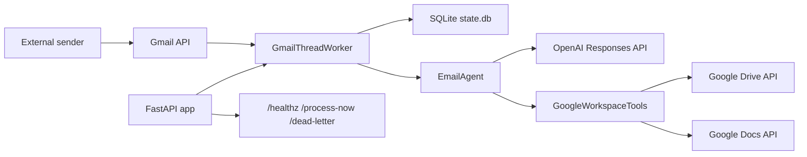
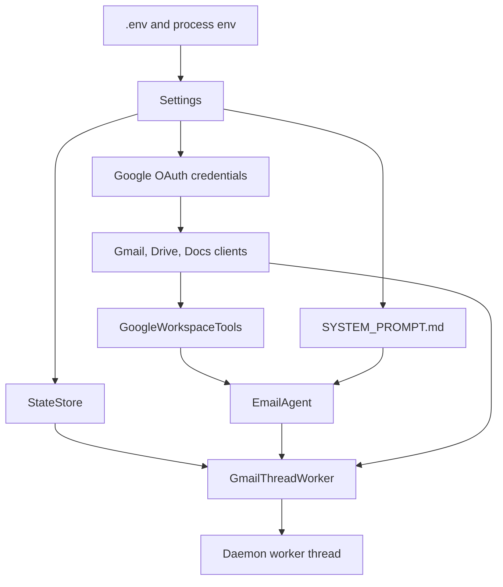
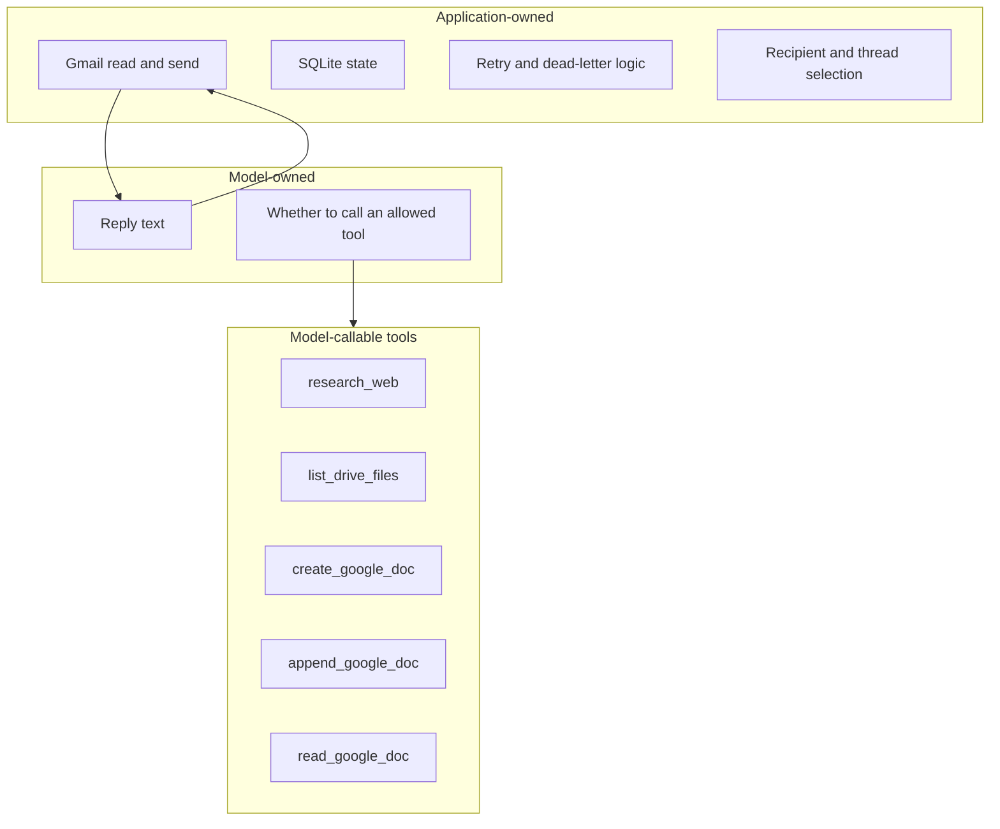

# Architecture

_Last verified against commit `b09c4f1`._

## System Overview

Canna Mailroom is a single-process FastAPI application that starts a background Gmail polling worker inside the same process. The worker reads inbound Gmail messages, restores thread continuity from SQLite, generates a reply through the OpenAI Responses API, optionally runs a small set of Google Drive and Google Docs tools, then sends the reply back into the original Gmail thread.

The code path for that startup lives in `app/main.py`. Configuration is loaded from environment variables in `app/settings.py`. Google OAuth credentials and service clients come from `app/google_clients.py`. The worker loop itself lives in `app/gmail_worker.py`.

## Runtime Topology

## Startup Sequence

At application startup, `app.main.startup()` performs these steps in order:

1. Read settings from environment variables.
2. Load or refresh Google OAuth credentials.
3. Build Gmail, Drive, and Docs API clients.
4. Initialize the SQLite state store.
5. Build the Google Workspace tool wrapper.
6. Load the system prompt and initialize the OpenAI email agent.
7. Create the `GmailThreadWorker`.
8. Start `worker.run_forever()` in a daemon thread.

## Component Responsibilities

| Component | File | Responsibility | Notes |
|---|---|---|---|
| FastAPI app | `app/main.py` | startup orchestration and operator endpoints | Exposes `/healthz`, `/process-now`, `/dead-letter`, and `/dead-letter/requeue/{message_id}` |
| Settings loader | `app/settings.py` | environment-driven configuration | All runtime tuning is env-based rather than CLI-flag based |
| Google client factory | `app/google_clients.py` | OAuth bootstrap, token refresh, API client creation | Uses local `credentials.json` and `token.json` files |
| State store | `app/state.py` | SQLite schema creation and state access | Persists thread pointers, processed message IDs, dead letters, and outbound reply tracking |
| Email agent | `app/ai_agent.py` | OpenAI Responses API calls and tool-call loop | Loads `SYSTEM_PROMPT.md` once at startup |
| Workspace tools | `app/tools.py` | concrete Drive and Docs side effects | The model never calls Gmail directly |
| Gmail worker | `app/gmail_worker.py` | polling, parsing, retries, dead-lettering, reply send path | Owns recipient selection, message send, and reply idempotency checks |

## Ownership Boundaries

The application and the model do not own the same decisions.

| Concern | Owned by | Evidence in code |
|---|---|---|
| Which mailbox is monitored | Application | `app/settings.py`, `app/google_clients.py`, `app/gmail_worker.py` |
| Which Gmail messages are eligible | Application | `GmailThreadWorker.process_once()` uses `is:unread -from:me` |
| Whether a message is skipped as self-message or empty text | Application | `GmailThreadWorker._process_message_once()` |
| Which thread/session is used | Application | Gmail `threadId` plus `StateStore.get_last_response_id()` |
| Which recipient gets the reply | Application | `_send_reply()` uses parsed inbound `From` header |
| Reply body and tool usage | Model | `EmailAgent.respond_in_thread()` |
| Which tools are available | Application | `EmailAgent._tool_specs()` |
| Retry timing and dead-lettering | Application | `GmailThreadWorker._process_message_with_retry()` |

## Tooling Boundaries

The tool list is hardcoded in `EmailAgent._tool_specs()`:

| Tool | Implementation | Side effect | Notes |
|---|---|---|---|
| `research_web` | `EmailAgent._research_web()` | external web research via OpenAI web search | Executes a nested `responses.create()` call |
| `list_drive_files` | `GoogleWorkspaceTools.list_drive_files()` | reads Drive metadata | Optional folder scoping |
| `create_google_doc` | `GoogleWorkspaceTools.create_google_doc()` | creates a Google Doc | Can insert initial content |
| `append_google_doc` | `GoogleWorkspaceTools.append_google_doc()` | writes to an existing Google Doc | Appends `\n` plus content |
| `read_google_doc` | `GoogleWorkspaceTools.read_google_doc()` | reads Google Doc text | Returns content capped to 12,000 chars |

No Gmail read, Gmail send, or inbox-management tool is exposed to the model. Gmail remains application-owned transport logic.

## Key Constraints

- Single-process and single-instance by design
- Local SQLite state only
- Local OAuth desktop flow and token file
- Polling rather than webhook or push delivery
- No human approval gate before outbound send
- Limited observability: stdout plus health endpoint

## Non-Goals In Current Code

- multi-tenant mailbox orchestration
- horizontal worker coordination
- rich HTML email rendering
- attachment ingestion
- policy engines for sender allowlists or DLP
