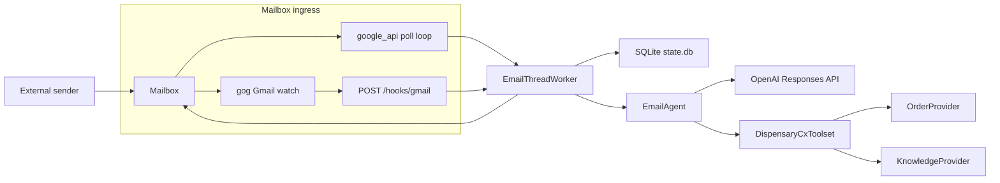
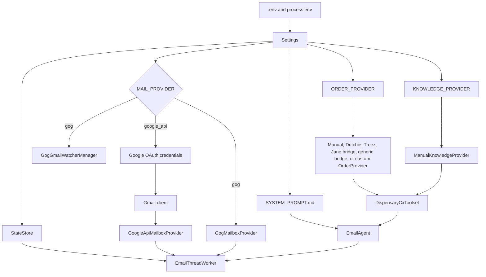

# Architecture

## System Overview

Canna Mailroom is a single-process FastAPI application with a provider-selected mailbox harness and a provider-agnostic dispensary CX tool layer.

- In `google_api` mode, startup builds a Gmail client and starts a background polling thread.
- In `gog` mode, startup builds a `gog` watcher manager, exposes `POST /hooks/gmail`, and processes hook-delivered messages through the same worker core.
- In both modes, the agent uses the same `DispensaryCxToolset` with exactly two model-callable tools.

## Runtime Topology

## Startup Sequence

## Component Responsibilities

| Component | File | Responsibility |
|---|---|---|
| FastAPI app | `app/main.py` | startup orchestration and operator endpoints |
| Email agent | `app/ai_agent.py` | OpenAI Responses API calls and tool loop |
| CX toolset | `app/cx_toolset.py` | exact two-tool surface exposed to the model |
| CX providers | `app/cx_providers.py` | provider contracts, manual knowledge/orders, Dutchie and Treez adapters, bridge-backed Jane support, generic bridge support, and custom loader |
| Gmail API provider | `app/google_mailbox.py` | Gmail read/send/thread scan/mark-read in `google_api` mode |
| `gog` provider | `app/gog_mailbox.py` | outbound reply send in `gog` mode |
| `gog` watcher manager | `app/gog_watcher.py` | `gog gmail watch start/serve` lifecycle |
| State store | `app/state.py` | SQLite schema creation and state access |
| Email worker | `app/gmail_worker.py` | provider-agnostic processing, retries, dead-lettering, send path |

## Ownership Boundaries

| Concern | Owned by |
|---|---|
| mailbox transport and ingress mode | application |
| recipient and reply thread | application |
| retry timing and dead-lettering | application |
| prompt text and final reply body | model |
| whether to call `lookup_order` or `search_store_knowledge` | model within the allowed tool list |
| vendor-specific order lookup behavior | selected `OrderProvider` |
| store hours, policy, and contact data | selected `KnowledgeProvider` |

## Tooling Boundaries

The model can call only:

- `lookup_order`
- `search_store_knowledge`

No mode exposes Gmail read/send as a model tool. No mode exposes web search, inventory browsing, refund execution, or order mutation.

## Current Constraints

- single mailbox per runtime
- single active process per mailbox
- local SQLite state only
- no human approval gate before outbound send
- no attachment handling
- `gog` mode still requires one deployer-owned GCP project plus a public HTTPS push path

## Non-Goals In Current Code

- multi-mailbox orchestration
- horizontal worker coordination
- HTML email rendering
- live inventory/product recommendation workflows
- order edits, cancellations, or refund execution
