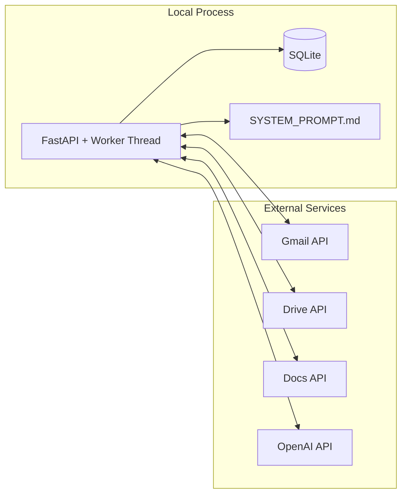

# Architecture

_Last verified against commit `7317103`._

## System overview

Canna Mailroom is a single-process FastAPI service with a background thread worker.

At startup (`app/main.py`), the system:
1. loads settings (`app/settings.py`),
2. acquires Google OAuth credentials (`app/google_clients.py`),
3. initializes Gmail/Drive/Docs clients,
4. initializes SQLite state (`app/state.py`),
5. initializes the OpenAI email agent (`app/ai_agent.py`),
6. starts `GmailThreadWorker.run_forever()` (`app/gmail_worker.py`).

## Component responsibilities

- **FastAPI app (`app/main.py`)**
  - lifecycle orchestration
  - exposes `/healthz` and `/process-now`
- **Gmail worker (`app/gmail_worker.py`)**
  - unread polling
  - inbound parsing + dedupe
  - bounded retries with exponential backoff on transient errors
  - dead-letter persistence on exhausted/non-transient failures
  - outbound send + mark read
- **AI agent wrapper (`app/ai_agent.py`)**
  - OpenAI Responses API calls
  - session chaining via `previous_response_id`
  - tool-call execution loop
- **Workspace tools (`app/tools.py`)**
  - Drive/Docs concrete side-effect actions
- **State store (`app/state.py`)**
  - thread memory pointer persistence
  - processed message dedupe persistence
- **Google clients (`app/google_clients.py`)**
  - OAuth token bootstrapping/refresh
  - API client creation

## Architecture diagram

```mermaid
graph TD
    U[External sender] --> GIN[Gmail Inbox]
    GIN --> W[GmailThreadWorker\napp/gmail_worker.py]
    W --> ST[(SQLite state.db\napp/state.py)]
    W --> A[EmailAgent\napp/ai_agent.py]
    A --> OAI[OpenAI Responses API]
    A --> T[GoogleWorkspaceTools\napp/tools.py]
    T --> GD[Google Drive API]
    T --> DOC[Google Docs API]
    W --> GOUT[Gmail send reply]

    M[FastAPI app\napp/main.py] --> W
    M --> HC[/healthz,/process-now]
```

## Runtime ownership boundaries



## Tooling boundaries

Current model-callable tools (hardcoded in `EmailAgent._tool_specs`):
- `research_web` (implemented via nested OpenAI Responses API call with `web_search`)
- `list_drive_files`
- `create_google_doc`
- `append_google_doc`
- `read_google_doc`

No direct Gmail tool is exposed to the model (Gmail handling is app-owned worker logic).

## Non-goals in current implementation

- multi-tenant runtime
- parallel worker coordination
- approval workflow before outbound email
- webhook-driven Gmail ingestion
- structured observability stack beyond stdout + health endpoint
