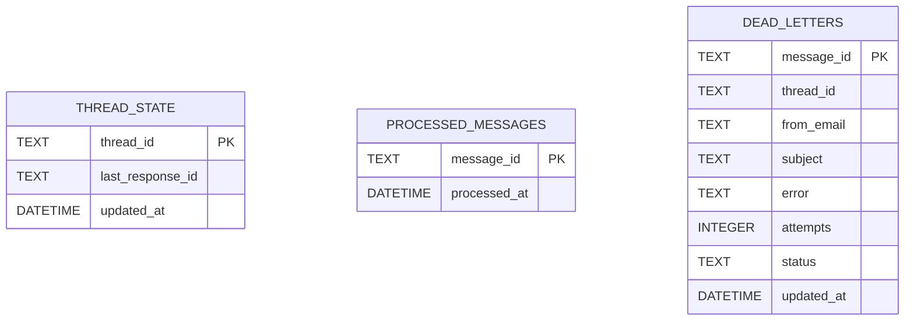
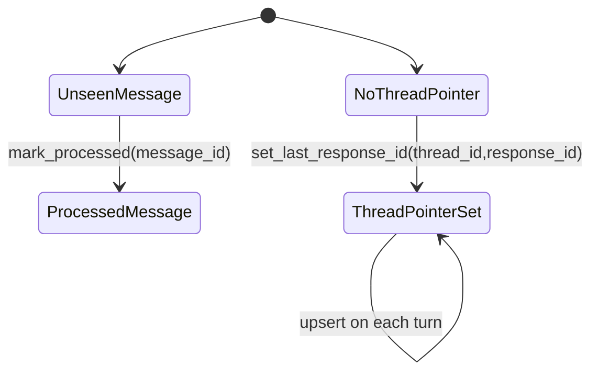

# Data Model

_Last verified against commit `7317103`._

This project has three persisted entities in SQLite (`app/state.py`) and several runtime payload shapes.

## Persisted tables

### `thread_state`

Purpose: map Gmail thread to latest OpenAI response pointer.

Columns:
- `thread_id TEXT PRIMARY KEY`
- `last_response_id TEXT`
- `updated_at DATETIME DEFAULT CURRENT_TIMESTAMP`

Write behavior:
- upsert on each successful outbound response (`set_last_response_id`)

### `processed_messages`

Purpose: dedupe already-handled Gmail message IDs.

Columns:
- `message_id TEXT PRIMARY KEY`
- `processed_at DATETIME DEFAULT CURRENT_TIMESTAMP`

Write behavior:
- insert ignore during processing (`mark_processed`)
- explicit delete on operator requeue (`unmark_processed`)

### `dead_letters`

Purpose: persist failed message runs after retry exhaustion or non-transient failures.

Columns:
- `message_id TEXT PRIMARY KEY`
- `thread_id TEXT`
- `from_email TEXT`
- `subject TEXT`
- `error TEXT`
- `attempts INTEGER`
- `status TEXT` (`dead_letter` or `requeued`)
- `updated_at DATETIME DEFAULT CURRENT_TIMESTAMP`

Write behavior:
- upsert on failure terminal path (`upsert_dead_letter`)
- status update on operator requeue (`mark_dead_letter_requeued`)
- delete on successful replay (`clear_dead_letter`)

## ER diagram

## Runtime payload shapes (non-persisted)

### Gmail inbound (subset used)
Source: Gmail API `users.messages.get(..., format="full")` in `app/gmail_worker.py`

Fields read:
- `id`
- `threadId`
- `payload.headers[]` (`from`, `subject`, `message-id`)
- `payload.body.data` or `payload.parts[].body.data`

### AI request payload
Source: `EmailAgent.respond_in_thread` in `app/ai_agent.py`

- system prompt text from file
- user content + prefixed email metadata
- optional `previous_response_id`
- tool schema list

### AI tool output payload
Function-call output envelope:
- `type: function_call_output`
- `call_id`
- `output` (JSON string)

## State transition for persisted records

## Migration/versioning notes

- No migration framework exists yet.
- Schema is created lazily by `StateStore._init_db()` at runtime.
- Backward compatibility strategy is currently “single-version local MVP.”

Recommended next step:
- introduce migration tool (e.g., Alembic/sqlite migration scripts) before schema growth.
