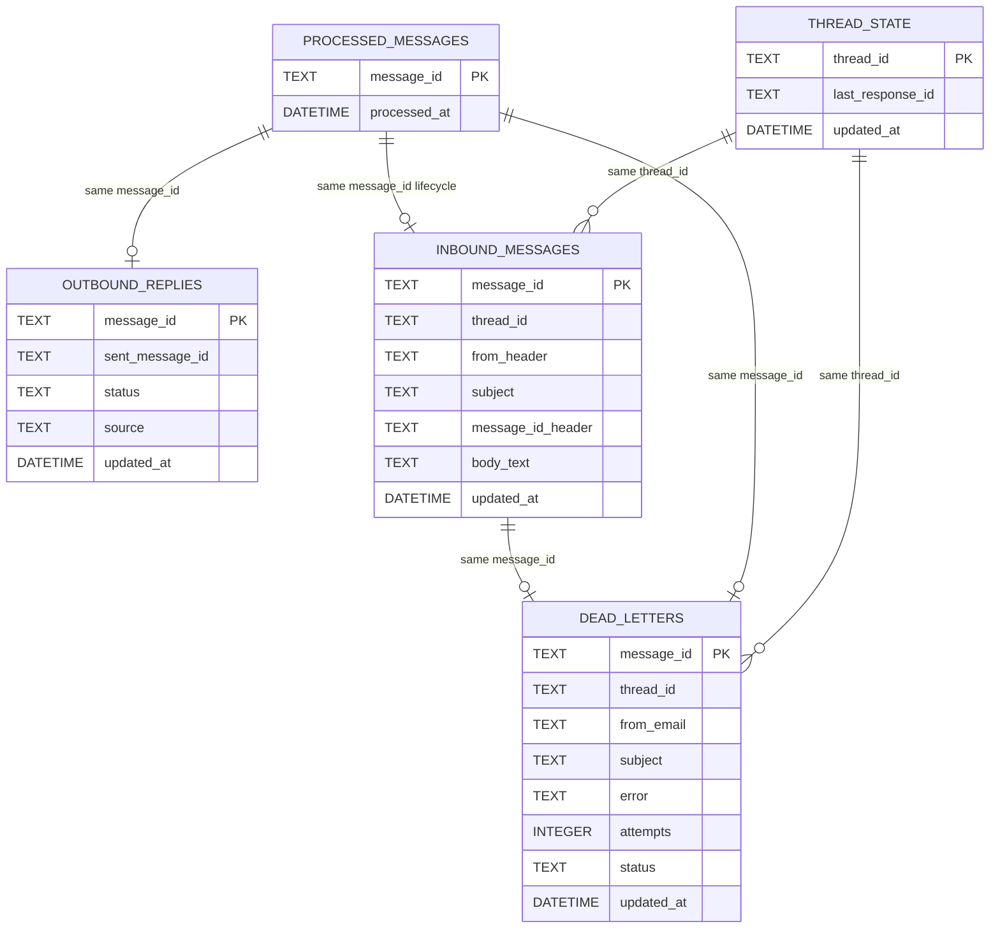
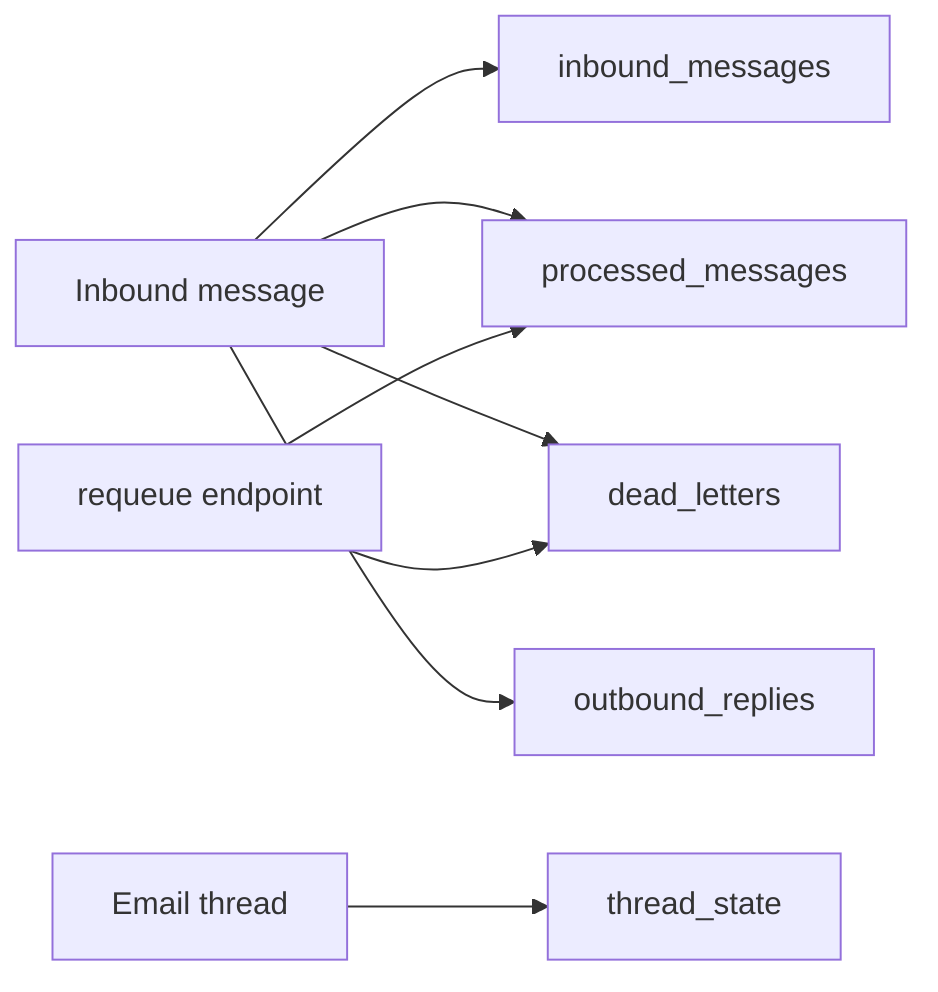

# Data Model

_Last verified against commit `b6c46e6`._

SQLite is the only persisted store in the current implementation. The schema is created lazily by `StateStore._init_db()` in `app/state.py` at startup.

## Persisted Tables

| Table | Primary key | Written by | Read by | Purpose |
|---|---|---|---|---|
| `thread_state` | `thread_id` | worker after successful reply | worker before model call | maps an email thread to the latest OpenAI `response.id` |
| `processed_messages` | `message_id` | worker on skip, success, or dead-letter | worker before processing | deduplicates inbound messages |
| `dead_letters` | `message_id` | retry wrapper on terminal failure | dead-letter API and replay path | records failed message runs and replay status |
| `outbound_replies` | `message_id` | send idempotency guard | send idempotency guard | records whether a reply was already sent for an inbound message |
| `inbound_messages` | `message_id` | worker before or during processing | worker retry and replay path | stores a normalized inbound message snapshot, including body text |

## Table Details

### `thread_state`

Purpose: preserve conversation continuity per thread.

Columns:
- `thread_id TEXT PRIMARY KEY`
- `last_response_id TEXT`
- `updated_at DATETIME DEFAULT CURRENT_TIMESTAMP`

Write behavior:
- upsert via `set_last_response_id(thread_id, response_id)` after a successful reply send path

Read behavior:
- `get_last_response_id(thread_id)` before `EmailAgent.respond_in_thread()`

### `processed_messages`

Purpose: prevent the same inbound message from being processed twice.

Columns:
- `message_id TEXT PRIMARY KEY`
- `processed_at DATETIME DEFAULT CURRENT_TIMESTAMP`

Write behavior:
- insert via `mark_processed(message_id)` when a message is skipped, completed, or dead-lettered
- delete via `unmark_processed(message_id)` when an operator requeues a dead-letter item

Read behavior:
- `is_processed(message_id)` before worker processing

### `dead_letters`

Purpose: store message runs that exhausted retries or failed with a non-transient error.

Columns:
- `message_id TEXT PRIMARY KEY`
- `thread_id TEXT`
- `from_email TEXT`
- `subject TEXT`
- `error TEXT`
- `attempts INTEGER DEFAULT 1`
- `status TEXT DEFAULT 'dead_letter'`
- `updated_at DATETIME DEFAULT CURRENT_TIMESTAMP`

Write behavior:
- upsert via `upsert_dead_letter(...)` on terminal failure
- update to `requeued` via `mark_dead_letter_requeued(message_id)` when an operator retries a message
- delete via `clear_dead_letter(message_id)` after successful replay

### `outbound_replies`

Purpose: reduce duplicate replies when retries or partial failures occur around the send path.

Columns:
- `message_id TEXT PRIMARY KEY`
- `sent_message_id TEXT`
- `status TEXT DEFAULT 'sent'`
- `source TEXT`
- `updated_at DATETIME DEFAULT CURRENT_TIMESTAMP`

Write behavior:
- upsert via `mark_reply_sent(message_id, sent_message_id, source)` after detecting or sending a reply

Read behavior:
- `has_reply_been_sent(message_id)` before attempting a send

Notes:
- `source` records whether the worker confirmed the reply through the direct send path (`api_send`) or by scanning the thread (`thread_scan`)

### `inbound_messages`

Purpose: keep a normalized inbound snapshot available for retries, requeues, and hook-driven processing.

Columns:
- `message_id TEXT PRIMARY KEY`
- `thread_id TEXT NOT NULL`
- `from_header TEXT NOT NULL`
- `subject TEXT NOT NULL`
- `message_id_header TEXT`
- `body_text TEXT NOT NULL`
- `updated_at DATETIME DEFAULT CURRENT_TIMESTAMP`

Write behavior:
- upsert via `upsert_inbound_message(message)` when a message is loaded from Gmail API or delivered through `/hooks/gmail`

Read behavior:
- `get_inbound_message(message_id)` when the provider cannot refetch the original message during retries or replay

Lifecycle notes:
- successful runs delete the snapshot
- self-message and empty-body skips delete the snapshot
- terminal failures can leave the snapshot in place until replay or manual cleanup

## Conceptual Relationships

SQLite does not enforce foreign keys here. The relationships below are conceptual relationships used by the worker logic.

## Persistence Checkpoints

## Runtime Payload Shapes

### Normalized inbound message

Used by `app/mailbox.py` and `app/gmail_worker.py`:

- `message_id`
- `thread_id`
- `from_header`
- `subject`
- `message_id_header`
- `body_text`

### AI request payload

Built in `EmailAgent.respond_in_thread()`:

- system prompt text loaded from `SYSTEM_PROMPT.md`
- user content with an `EMAIL CONTEXT` prefix containing `From`, `Subject`, and `Thread-ID`
- optional `previous_response_id`
- tool specification list

### AI tool output payload

Built in the tool loop in `app/ai_agent.py`:

- `type: function_call_output`
- `call_id`
- `output` as a JSON string

## Versioning And Migration Notes

- No migration framework exists yet.
- The application relies on `CREATE TABLE IF NOT EXISTS` during startup.
- The compatibility model is effectively single-version local deployment.
- Existing databases are forward-filled with newly added tables on startup, as long as schema additions are additive.
