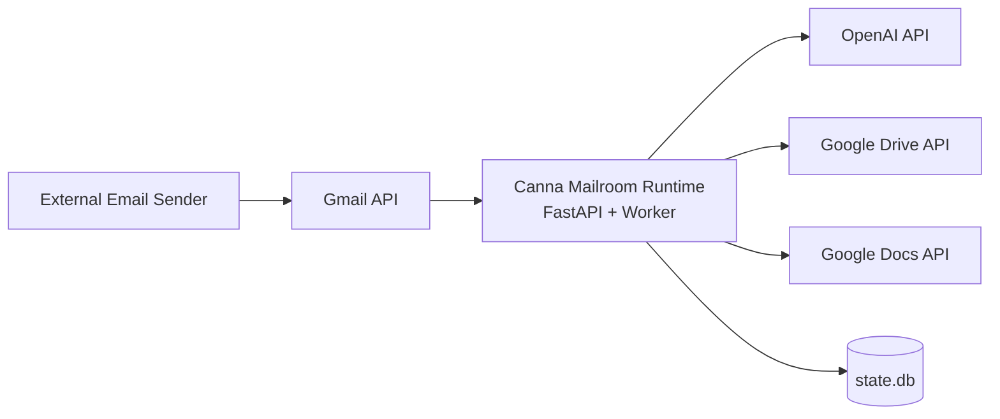

# Deployment Guide (Local, GCP, AWS)

_Last verified against commit `113f40f`._

This guide covers practical deployment patterns for the current implementation:
- local machine
- Google Cloud Platform (GCP)
- Amazon Web Services (AWS)

> Current runtime is a single-process FastAPI app that starts an in-process polling worker thread (`app/main.py`).

---

## 1) Local deployment (recommended for MVP)

### Prerequisites
- Python 3.11+
- `credentials.json` (Google OAuth Desktop client)
- `.env` with required settings

### Steps

```bash
cd /Users/glitch/Projects/canna-mailroom
python3 -m venv .venv
source .venv/bin/activate
pip install -e .
cp .env.example .env
# fill OPENAI_API_KEY + AGENT_EMAIL
python scripts/auth_google.py
uvicorn app.main:app --host 127.0.0.1 --port 8787
```

### Validate

```bash
curl http://127.0.0.1:8787/healthz
```

---

## 2) Local production-style (systemd on Linux/macOS-equivalent supervisor)

Use this when you want auto-restart and boot-time startup.

### Example systemd unit (Linux)

```ini
[Unit]
Description=Canna Mailroom
After=network.target

[Service]
Type=simple
WorkingDirectory=/opt/canna-mailroom
EnvironmentFile=/opt/canna-mailroom/.env
ExecStart=/opt/canna-mailroom/.venv/bin/uvicorn app.main:app --host 0.0.0.0 --port 8787
Restart=always
RestartSec=5
User=mailroom

[Install]
WantedBy=multi-user.target
```

### Enable

```bash
sudo systemctl daemon-reload
sudo systemctl enable canna-mailroom
sudo systemctl start canna-mailroom
sudo systemctl status canna-mailroom
```

---

## 3) GCP deployment options

## Option A: Compute Engine VM (best fit for current OAuth + polling worker)

This matches current architecture with minimal refactor.

### Steps
1. Create Debian/Ubuntu VM.
2. Install Python 3.11+, git.
3. Clone repo and set up venv.
4. Place `.env`, `credentials.json`.
5. Run OAuth once interactively to produce `token.json`.
6. Run with systemd (example above).

### Notes
- Keep `token.json` and `credentials.json` on disk with strict permissions.
- Use firewall rules to limit access to port 8787 (or keep private behind reverse proxy).

## Option B: Cloud Run (requires adjustment)

Cloud Run is stateless and not ideal for:
- local token-file OAuth assumptions
- in-process polling worker + SQLite file state

To use Cloud Run safely, you should first refactor to:
- external state store (Cloud SQL)
- non-local token/auth model (service-to-service or secure secret handling)
- push/event architecture instead of long polling

For current code, **Compute Engine is the recommended GCP path**.

---

## 4) AWS deployment options

## Option A: EC2 (best fit for current implementation)

### Steps
1. Launch Ubuntu EC2 instance.
2. Install Python 3.11+, git.
3. Clone repo and set up venv.
4. Upload `.env` + `credentials.json`.
5. Run OAuth once to create `token.json`.
6. Run via systemd service.

### Security group
- Allow SSH from trusted IPs only.
- Expose app port only if needed; prefer reverse proxy + TLS.

## Option B: ECS/Fargate (requires adjustment)

Current code assumes local files (`token.json`, `state.db`) and in-process worker lifecycle.
For ECS/Fargate, first refactor to:
- external DB (RDS)
- managed secret/token strategy
- explicit worker service model

For today, **EC2 is the practical AWS path**.

---

## 5) Required environment variables

From `.env.example`:

- `OPENAI_API_KEY`
- `OPENAI_MODEL` (default `gpt-5.4`)
- `AGENT_EMAIL`
- `POLL_SECONDS`
- `STATE_DB`
- `GOOGLE_TOKEN_FILE`
- `GOOGLE_CREDENTIALS_FILE`
- `GOOGLE_DRIVE_DEFAULT_FOLDER_ID`
- `SYSTEM_PROMPT_FILE`

---

## 6) Deployment topology visual



---

## 7) Post-deploy checklist

- [ ] `/healthz` returns `ok=true` and `worker_alive=true`
- [ ] test inbound email gets reply
- [ ] second reply in same thread preserves context
- [ ] service restarts cleanly after reboot
- [ ] secrets are not committed and have restrictive file permissions

---

## 8) Known deployment limitations

Current code is optimized for single-instance operation.
Avoid active-active multi-instance deployment against the same mailbox unless you add distributed locking and shared state.
