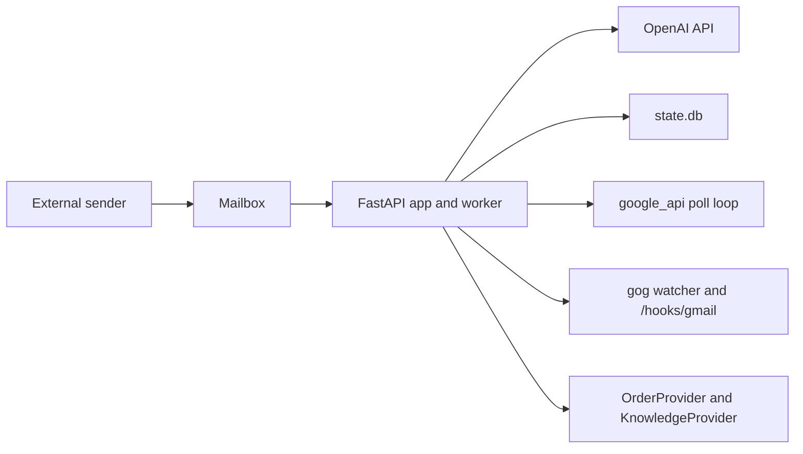

# Deployment Guide

This guide covers deployment options that fit the current codebase. The runtime is a single FastAPI process with one selected mailbox provider and one local SQLite state file.

## Deployment Fit Summary

| Environment | Fit today | Why |
|---|---|---|
| local machine | best fit | matches local files, single process, and iterative setup |
| single VM or single host | good fit | keeps file-based state intact and avoids multi-instance issues |
| Cloud Run | poor fit without refactor | stateful worker and local files do not fit serverless lifecycle cleanly |
| ECS/Fargate | poor fit without refactor | same state and singleton-worker mismatch |

## Runtime Topology



## Files That Must Exist Or Persist

| File | Purpose | Mode |
|---|---|---|
| `.env` | runtime configuration | all modes |
| `state.db` | runtime state | all modes |
| `SYSTEM_PROMPT.md` | agent instructions | all modes |
| `STORE_KNOWLEDGE_FILE` target | store-owned FAQ and policy data | all modes |
| `credentials.json` | Google OAuth desktop client | `google_api` only |
| `token.json` | Google access and refresh token | `google_api` only |
| `MANUAL_ORDER_FILE` target | manual order lookup data | when `ORDER_PROVIDER=manual` |
| `TREEZ_PRIVATE_KEY_FILE` target | Treez PEM signing key | when `ORDER_PROVIDER=treez` |
| custom provider module code | custom order adapter implementation | when `ORDER_PROVIDER=custom` |

Important note:
- In `gog` mode, Mailroom does not use `credentials.json` or `token.json`.
- `gog` still manages its own Google auth material outside this repo.
- In `dutchie`, `treez`, `jane`, and `bridge` modes, provider credentials still live in `.env`.

## Local Deployment

### Simplest local bring-up: `google_api`

```bash
make setup
source .venv/bin/activate
mailroom setup
mailroom doctor
mailroom run --reload
```

Validate:

```bash
curl http://127.0.0.1:8787/healthz
```

### Hook-based local bring-up: `gog`

Only use this path if you already have:
- `gog` on `PATH`
- one deployer-owned GCP project and Pub/Sub topic
- a public HTTPS push endpoint for Gmail Pub/Sub

Then:

```bash
make setup
source .venv/bin/activate
mailroom setup
mailroom doctor
mailroom run --reload
```

Validate:

```bash
curl http://127.0.0.1:8787/healthz
```

Look for:
- `mail_provider: "gog"`
- `ingress_mode: "hook"`
- `watcher_alive: true`

## Single-Host Supervised Deployment

For a stable always-on deployment, run on one host with a supervisor.

### Example `systemd` unit

```ini
[Unit]
Description=Canna Mailroom
After=network.target

[Service]
Type=simple
WorkingDirectory=/opt/canna-mailroom
EnvironmentFile=/opt/canna-mailroom/.env
ExecStart=/opt/canna-mailroom/.venv/bin/mailroom run
Restart=always
RestartSec=5
User=mailroom

[Install]
WantedBy=multi-user.target
```

Operational notes:
- persist `.env`, `state.db`, `SYSTEM_PROMPT.md`, and the configured knowledge/order files
- also persist `credentials.json` and `token.json` in `google_api` mode
- run exactly one instance for the mailbox
- keep the HTTP port private or place it behind a reverse proxy

## Provider-Specific Notes

### `google_api`

Best when:
- you want the shortest path to a working mailbox
- you want the simplest local mailbox harness
- local polling is acceptable

Operational requirements:
- one-time Google OAuth flow
- durable `token.json`

### `dutchie`, `treez`, `jane`, and `bridge`

Operational requirements:
- keep the provider credentials current in `.env`
- for `treez`, persist the PEM private key file referenced by `TREEZ_PRIVATE_KEY_FILE`
- for `jane` and `bridge`, keep the bridge endpoint reachable from the Mailroom host

### `gog`

Best when:
- you want hook-style Gmail ingress
- you are comfortable managing `gog`, Pub/Sub, and a public push path

Operational requirements:
- `gog` installed on the host
- deployer-owned GCP topic for Gmail watch
- public HTTPS push delivery
- `gog` auth managed outside Mailroom

## Post-Deploy Checklist

- [ ] `/healthz` returns `ok=true`
- [ ] `/healthz` reports the expected `mail_provider`
- [ ] `watcher_alive=true` in `gog` mode
- [ ] a test email receives a reply
- [ ] a second message in the same thread preserves context
- [ ] `state.db` survives restart
- [ ] only one active worker instance is pointed at the mailbox

## Known Deployment Limits

- single-instance only
- local-file state
- no horizontal scaling support
- `google_api` depends on local OAuth files
- `gog` depends on external watcher plumbing
