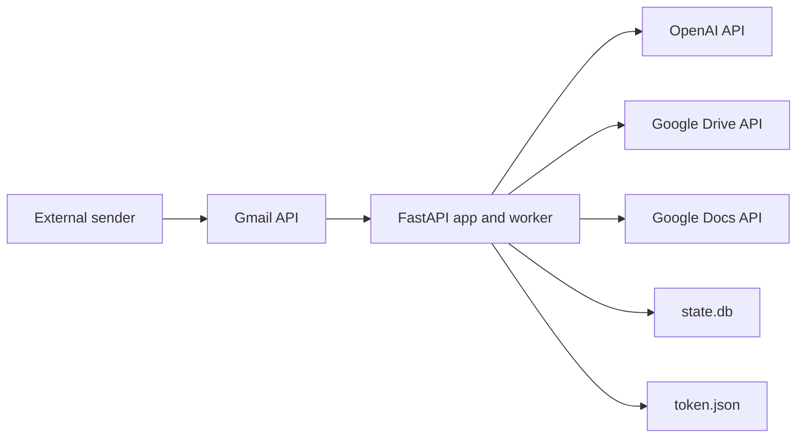

# Deployment Guide

_Last verified against commit `b09c4f1`._

This guide covers deployment options that fit the current codebase. The current runtime is a single FastAPI process with an in-process polling worker, local OAuth files, and local SQLite state.

## Deployment Fit Summary

| Environment | Fit today | Why |
|---|---|---|
| local machine | best fit | matches local OAuth flow, SQLite, and in-process worker model |
| single VM or single host | good fit | keeps file-based auth and state intact |
| Cloud Run | poor fit without refactor | stateless model conflicts with local token and SQLite files |
| ECS/Fargate | poor fit without refactor | same file-state and worker-lifecycle mismatch |

## Runtime Topology



## Files That Must Exist Or Persist

| File | Purpose | Typical lifecycle |
|---|---|---|
| `.env` | runtime configuration | created once and edited as needed |
| `credentials.json` | Google OAuth desktop client | provided by Google Cloud console |
| `token.json` | Google access and refresh token | created by `make auth`, must persist |
| `state.db` | runtime state | created on startup, must persist |
| `SYSTEM_PROMPT.md` | agent instructions | persists and requires restart after changes |

## Local Deployment

Recommended for development and MVP evaluation.

```bash
python3 -m venv .venv
source .venv/bin/activate
pip install -e .
cp .env.example .env
# fill OPENAI_API_KEY and AGENT_EMAIL
python scripts/auth_google.py
uvicorn app.main:app --host 127.0.0.1 --port 8787
```

Validate:

```bash
curl http://127.0.0.1:8787/healthz
```

## Single-Host Supervised Deployment

For a more stable always-on deployment, run on one host with a supervisor.

### Example `systemd` unit

```ini
[Unit]
Description=Canna Mailroom
After=network.target

[Service]
Type=simple
WorkingDirectory=/opt/canna-mailroom
EnvironmentFile=/opt/canna-mailroom/.env
ExecStart=/opt/canna-mailroom/.venv/bin/uvicorn app.main:app --host 127.0.0.1 --port 8787
Restart=always
RestartSec=5
User=mailroom

[Install]
WantedBy=multi-user.target
```

Operational notes:
- persist `.env`, `credentials.json`, `token.json`, and `state.db`
- run exactly one instance for the mailbox
- keep the HTTP port private or place it behind a reverse proxy

## GCP

### Recommended: Compute Engine VM

This matches the current architecture with the least change.

Steps:
1. create a Linux VM
2. install Python 3.11+ and git
3. clone the repo
4. place `.env` and `credentials.json`
5. run the OAuth flow once interactively to create `token.json`
6. run the app under `systemd`

### Not Recommended Yet: Cloud Run

Current blockers:
- local token-file OAuth model
- local SQLite state
- in-process worker loop

To make Cloud Run fit, the app would need:
- external persistent state
- a different auth/token strategy
- explicit worker separation or push-driven ingress

## AWS

### Recommended: EC2

EC2 is the closest match to the current design. The same single-host guidance applies.

### Not Recommended Yet: ECS Or Fargate

Current blockers:
- local file dependencies
- in-process worker lifecycle
- no distributed coordination

## Post-Deploy Checklist

- [ ] `/healthz` returns `ok=true`
- [ ] `/healthz` returns `worker_alive=true`
- [ ] a test email receives a reply
- [ ] a second message in the same thread preserves context
- [ ] `token.json` and `state.db` survive restart
- [ ] only one active worker instance is pointed at the mailbox

## Known Deployment Limits

- single-instance only
- local-file auth and state
- no built-in TLS, reverse proxy, or service supervision
- no horizontal scaling support
