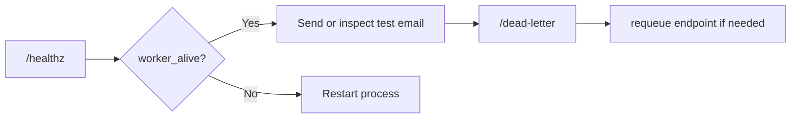
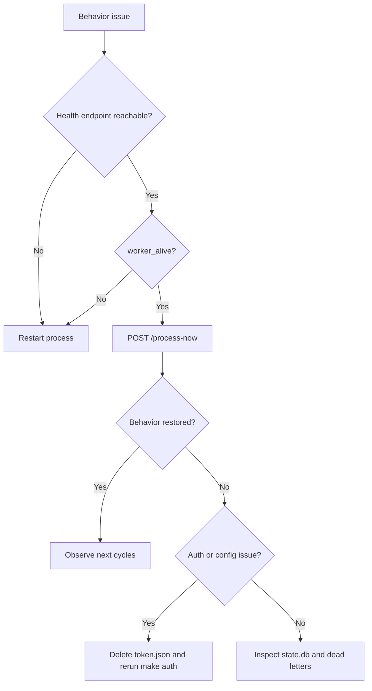

# Operations

_Last verified against commit `b09c4f1`._

This runbook is for the system as implemented today: one process, one worker thread, one mailbox, one SQLite file.

## Day-1 Setup Checklist

1. Create a dedicated Gmail account for the agent.
2. Create a Google Cloud project and enable Gmail, Drive, and Docs APIs.
3. Download the OAuth desktop client file as `credentials.json`.
4. Copy `.env.example` to `.env`.
5. Set `OPENAI_API_KEY` and `AGENT_EMAIL`.
6. Optionally set `GOOGLE_DRIVE_DEFAULT_FOLDER_ID`, `POLL_SECONDS`, and retry settings.
7. Run `make setup`.
8. Run `make auth` to create `token.json`.
9. Run `make run`.
10. Check `curl http://127.0.0.1:8787/healthz`.
11. Send a test email and reply in the same thread.

## Day-2 Operations

### Start

```bash
make run
```

### Stop

If you are running in the foreground, use `Ctrl-C`. For supervised deployments, use the process manager described in [deployment.md](deployment.md).

### Restart

Restart whenever you change:
- `.env`
- `SYSTEM_PROMPT.md`
- `credentials.json`
- `token.json`

### Tune

Environment variables that materially affect operations:

| Setting | Default | Effect |
|---|---|---|
| `POLL_SECONDS` | `20` | delay between worker cycles |
| `RETRY_MAX_ATTEMPTS` | `3` | max attempts per message |
| `RETRY_BASE_DELAY_MS` | `800` | retry backoff starting point |
| `RETRY_MAX_DELAY_MS` | `8000` | retry backoff cap |
| `RETRY_JITTER_MS` | `250` | retry jitter |
| `STATE_DB` | `./state.db` | active SQLite state file |
| `SYSTEM_PROMPT_FILE` | `./SYSTEM_PROMPT.md` | prompt file loaded at startup |

## Built-In Monitoring And Status Checks

Current built-in signals:

- `GET /healthz`
- worker stdout messages such as `Processed N email(s)`
- dead-letter records in SQLite

Current gaps:

- no structured logs
- no metrics exporter
- no alerting
- no tracing

## Operator Dashboard Flow



## Routine Checks

### Health

```bash
curl http://127.0.0.1:8787/healthz
```

Look for:
- `ok: true`
- `worker_alive: true`
- expected `poll_seconds`
- expected retry settings

### Force A Manual Cycle

```bash
curl -X POST http://127.0.0.1:8787/process-now
```

Use this when:
- you want to confirm the worker can still talk to Gmail and OpenAI
- you just requeued a dead-letter item
- you want immediate feedback without waiting for the next poll interval

### Inspect Dead Letters

```bash
curl "http://127.0.0.1:8787/dead-letter?limit=50"
```

Look for:
- repeated error class patterns
- auth failures
- rate-limit failures
- malformed prompt or tool-call failures

## State Inspection

If `sqlite3` is available on the host, these commands are useful. Replace `state.db` with the active `STATE_DB` path if you changed the default.

```bash
sqlite3 state.db ".tables"
sqlite3 state.db "select thread_id, last_response_id, updated_at from thread_state order by updated_at desc limit 20;"
sqlite3 state.db "select message_id, processed_at from processed_messages order by processed_at desc limit 20;"
sqlite3 state.db "select message_id, subject, status, attempts, updated_at from dead_letters order by updated_at desc limit 20;"
sqlite3 state.db "select message_id, sent_message_id, source, updated_at from outbound_replies order by updated_at desc limit 20;"
```

These are especially useful during wrong-context and duplicate-reply investigations.

## Incident Response

### Incident A: Startup Or Auth Failure

Symptoms:
- `make run` exits immediately
- `/healthz` is unreachable
- console shows credential or token errors

Response:
1. Verify `.env` paths and required values.
2. Confirm `credentials.json` exists at `GOOGLE_CREDENTIALS_FILE`.
3. Remove `token.json` if refresh looks broken.
4. Rerun `make auth`.
5. Restart the app.

### Incident B: No Replies

Symptoms:
- inbound email remains unread
- `/healthz` is up but nothing happens

Response:
1. Check `/healthz`.
2. Confirm `worker_alive=true`.
3. Run `POST /process-now`.
4. Inspect stdout for Gmail or OpenAI exceptions.
5. Check `/dead-letter` for terminal failures.
6. Re-auth if Google token issues are suspected.

### Incident C: Wrong Context In Replies

Symptoms:
- the model replies as if the thread history is wrong

Response:
1. Confirm the human stayed in the same Gmail thread.
2. Inspect `thread_state` in `state.db`.
3. Backup `state.db` before editing or deleting anything.
4. If a single thread pointer is clearly bad, remove that thread row and retry the message.
5. If the entire DB is untrustworthy, reset `state.db` only after accepting that all thread memory will be lost.

### Incident D: Duplicate Replies

Symptoms:
- the mailbox receives more than one reply to the same inbound email

Response:
1. Confirm only one active runtime instance is connected to the mailbox.
2. Inspect `outbound_replies` for the inbound `message_id`.
3. Inspect the Gmail thread for prior sent replies.
4. Confirm the `STATE_DB` path is stable and writable across restarts.
5. Treat multi-host processing against one mailbox as unsupported unless you add coordination.

### Incident E: Dead-Letter Growth

Symptoms:
- repeated items accumulate in `/dead-letter`

Response:
1. Inspect `/dead-letter`.
2. Group failures by error class.
3. Fix the root cause first.
4. Requeue selectively:
   - immediate replay: `process_now=true`
   - delayed replay: `process_now=false`
5. Run `POST /process-now` to confirm recovery.

## Recovery And Rollback Levels

| Level | Action | Impact |
|---|---|---|
| 1 | restart the process | no data loss if files remain intact |
| 2 | delete `token.json` and rerun `make auth` | forces reauthorization |
| 3 | delete or replace `state.db` | loses thread memory, dedupe history, dead letters, and outbound send tracking |



## Backup Guidance

Files worth backing up before making destructive changes:
- `.env`
- `credentials.json`
- `token.json`
- `state.db`
- any customized prompt file referenced by `SYSTEM_PROMPT_FILE`

## Operational Limits

- Run only one active instance per mailbox.
- Use a dedicated mailbox and a dedicated Drive folder.
- Avoid high-risk inboxes until allowlists and approval gating exist.
- Expect manual investigation for failures because observability is intentionally minimal.
