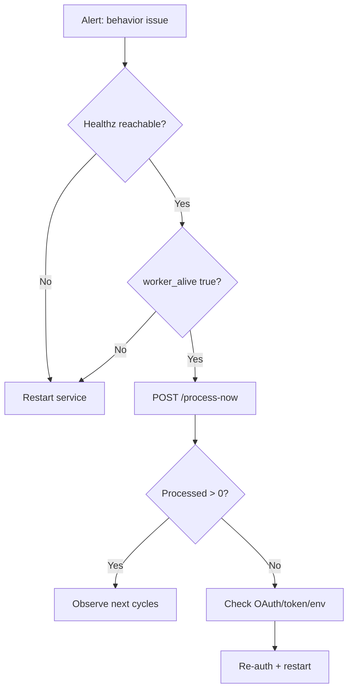

# Operations

_Last verified against commit `7317103`._

## Day-1 setup checklist

1. Create dedicated agent Gmail account.
2. Create Google Cloud project and enable Gmail/Drive/Docs APIs.
3. Download OAuth Desktop client as `credentials.json`.
4. Configure `.env` (`OPENAI_API_KEY`, `AGENT_EMAIL`).
5. Run `make auth`.
6. Run `make run`.
7. Validate `/healthz` and a test email thread.

## Day-2 operations

### Normal run

```bash
make run
```

### Status checks

- Health endpoint: `curl http://127.0.0.1:8787/healthz`
- Worker activity: watch stdout for `Processed N email(s)`

### Tuning

- Change poll interval by editing `POLL_SECONDS` in `.env`.
- Retry controls:
  - `RETRY_MAX_ATTEMPTS`
  - `RETRY_BASE_DELAY_MS`
  - `RETRY_MAX_DELAY_MS`
  - `RETRY_JITTER_MS`
- Restart process after env changes.

## Monitoring and logging

Current built-in signals:
- API liveness (`/healthz`)
- worker thread liveness (`worker_alive`)
- coarse throughput logs (`Processed N email(s)`)

Missing today (planned):
- structured logs with message/thread IDs
- latency histograms
- error counters
- alerting

## Incident response

### Incident class A: no replies

1. Check process and `/healthz`.
2. Ensure `worker_alive=true`.
3. Force cycle with `POST /process-now`.
4. Inspect logs for stacktrace.
5. Re-run OAuth if token issue suspected.

### Incident class B: wrong context in replies

1. Confirm user stayed in same Gmail thread.
2. Inspect/backup `state.db`.
3. Verify thread ID mapping exists in `thread_state`.
4. If needed, clear specific thread pointer and retry.

### Incident class C: duplicate replies

1. Ensure only one runtime instance is active.
2. Verify same mailbox isn’t processed by multiple hosts.
3. Confirm `state.db` is persistent and writable.

### Incident class D: dead-letter growth / exhausted retries

1. Inspect dead-letter queue:
   - `GET /dead-letter`
2. Review repeated error classes (auth, rate limit, malformed message, etc.).
3. Fix root cause.
4. Requeue selected message when safe:
   - `POST /dead-letter/requeue/{message_id}`
5. Trigger a manual cycle (`POST /process-now`) to confirm recovery.

## Recovery / rollback

- **Rollback level 1 (runtime):** stop process and restart.
- **Rollback level 2 (auth):** remove `token.json`, rerun `make auth`.
- **Rollback level 3 (state):** backup/remove `state.db` (resets memory continuity).

## Runbook flow



## Rollout guidance

For local MVP usage, manual restart is acceptable.
For wider internal use, package with a supervisor (`systemd`, Docker restart policy, or process manager).
