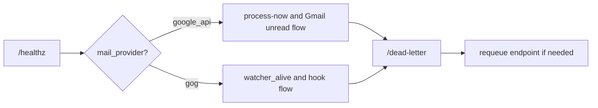
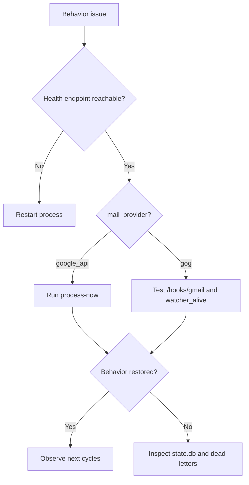

# Operations

_Last verified against commit `b6c46e6`._

This runbook covers the system as implemented today: one process, one mailbox, one SQLite file, and one selected provider.

## Day-1 Setup Checklist

### Fastest local path: `google_api`

1. Create a dedicated mailbox for the agent.
2. Run `make setup`.
3. Activate the virtual environment: `source .venv/bin/activate`.
4. Run `mailroom setup`.
5. Choose `MAIL_PROVIDER=google_api`.
6. Complete the local Google OAuth flow.
7. Run `mailroom doctor`.
8. Run `mailroom run --reload`.
9. Check `curl http://127.0.0.1:8787/healthz`.
10. Send a test email and reply in the same thread.

### Server-style hook path: `gog`

1. Install `gog` and `gcloud` on the host.
2. Prepare one deployer-owned GCP project and Pub/Sub topic.
3. Prepare a public HTTPS push endpoint for Gmail Pub/Sub.
4. Run `make setup`.
5. Activate the virtual environment: `source .venv/bin/activate`.
6. Run `mailroom setup`.
7. Choose `MAIL_PROVIDER=gog`.
8. Complete the `gog` connection prompts.
9. Run `mailroom doctor`.
10. Run `mailroom run --reload`.

## Day-2 Operations

### Start

```bash
mailroom run --reload
```

### Stop

If you are running in the foreground, use `Ctrl-C`. For supervised deployments, use the process manager described in [deployment.md](deployment.md).

### Restart

Restart whenever you change:
- `.env`
- `SYSTEM_PROMPT.md`
- `credentials.json` or `token.json` in `google_api` mode
- any `gog` watcher or token settings in `gog` mode

### Tune

Environment variables that materially affect operations:

| Setting | Default | Effect |
|---|---|---|
| `MAIL_PROVIDER` | `google_api` | selects polling or hook ingress |
| `POLL_SECONDS` | `20` | delay between polling cycles in `google_api` mode |
| `RETRY_MAX_ATTEMPTS` | `3` | max attempts per message |
| `RETRY_BASE_DELAY_MS` | `800` | retry backoff starting point |
| `RETRY_MAX_DELAY_MS` | `8000` | retry backoff cap |
| `RETRY_JITTER_MS` | `250` | retry jitter |
| `STATE_DB` | `./state.db` | active SQLite state file |
| `SYSTEM_PROMPT_FILE` | `./SYSTEM_PROMPT.md` | prompt file loaded at startup |
| `GOG_GMAIL_RENEW_EVERY_MINUTES` | `720` | watch renewal interval in `gog` mode |

## Built-In Monitoring And Status Checks

Current built-in signals:

- `GET /healthz`
- worker stdout such as `Processed N email(s)`
- watcher stdout and restart messages in `gog` mode
- dead-letter records in SQLite

Current gaps:

- no structured logs
- no metrics exporter
- no alerting
- no tracing

## Operator Dashboard Flow



## Routine Checks

### Health

```bash
curl http://127.0.0.1:8787/healthz
```

Look for:
- `ok: true`
- expected `mail_provider`
- expected `ingress_mode`
- `worker_alive: true`
- `watcher_alive: true` in `gog` mode

### Force A Manual Cycle

Only for `google_api` mode:

```bash
curl -X POST http://127.0.0.1:8787/process-now
```

Use this when:
- you want immediate feedback without waiting for the next poll interval
- you just requeued a dead-letter item
- you want to verify Gmail and OpenAI connectivity quickly

### Test The Hook Endpoint Directly

Useful for `gog` mode before trusting Gmail push delivery:

```bash
curl -X POST http://127.0.0.1:8787/hooks/gmail \
  -H "Authorization: Bearer <GOG_GMAIL_HOOK_TOKEN>" \
  -H "Content-Type: application/json" \
  -d '{
    "messages": [
      {
        "id": "ops-test-1",
        "threadId": "ops-test-thread",
        "from": "human@example.com",
        "subject": "Ops hook test",
        "body": "Can you reply to this?"
      }
    ]
  }'
```

If that works but real Gmail events do not arrive, the problem is usually outside Mailroom:
- Pub/Sub topic or subscription wiring
- push endpoint routing
- `gog gmail watch` setup

### Inspect Dead Letters

```bash
curl "http://127.0.0.1:8787/dead-letter?limit=50"
```

Look for:
- repeated error class patterns
- auth failures
- rate-limit failures
- tool-call or watcher configuration failures

## State Inspection

If `sqlite3` is available on the host, these commands are useful. Replace `state.db` with the active `STATE_DB` path if you changed the default.

```bash
sqlite3 state.db ".tables"
sqlite3 state.db "select thread_id, last_response_id, updated_at from thread_state order by updated_at desc limit 20;"
sqlite3 state.db "select message_id, processed_at from processed_messages order by processed_at desc limit 20;"
sqlite3 state.db "select message_id, subject, status, attempts, updated_at from dead_letters order by updated_at desc limit 20;"
sqlite3 state.db "select message_id, sent_message_id, source, updated_at from outbound_replies order by updated_at desc limit 20;"
sqlite3 state.db "select message_id, thread_id, subject, updated_at from inbound_messages order by updated_at desc limit 20;"
```

These are especially useful during wrong-context, hook replay, and duplicate-reply investigations.

## Incident Response

### Incident A: Startup Failure

Symptoms:
- `make run` exits immediately
- `/healthz` is unreachable
- console shows credential, watcher, or token errors

Response:
1. Verify `.env` paths and required values.
2. Run `mailroom doctor`.
3. In `google_api` mode, confirm `credentials.json` and `token.json`.
4. In `gog` mode, confirm `gog` is installed and the watcher settings are non-empty.
5. Restart the app.

### Incident B: No Replies In `google_api` Mode

Symptoms:
- inbound email remains unread
- `/healthz` is up but nothing happens

Response:
1. Check `/healthz`.
2. Confirm `mail_provider=google_api` and `worker_alive=true`.
3. Run `POST /process-now`.
4. Inspect stdout for Gmail or OpenAI exceptions.
5. Check `/dead-letter` for terminal failures.
6. Re-auth if Google token issues are suspected.

### Incident C: No Replies In `gog` Mode

Symptoms:
- `/healthz` is up
- `watcher_alive` is false, or the mailbox receives no hook-driven replies

Response:
1. Check `/healthz`.
2. Confirm `mail_provider=gog`, `ingress_mode=hook`, and `watcher_alive=true`.
3. Test `POST /hooks/gmail` directly with the hook token.
4. If direct hook works, inspect the Pub/Sub topic, subscription, and public push path.
5. If direct hook fails, inspect watcher startup output and rerun `mailroom connections`.

### Incident D: Wrong Context In Replies

Symptoms:
- the model replies as if the thread history is wrong

Response:
1. Confirm the human stayed in the same email thread.
2. Inspect `thread_state` in `state.db`.
3. Backup `state.db` before editing or deleting anything.
4. If a single thread pointer is clearly bad, remove that thread row and retry the message.

### Incident E: Duplicate Replies

Symptoms:
- the mailbox receives more than one reply to the same inbound email

Response:
1. Confirm only one active runtime instance is connected to the mailbox.
2. Inspect `outbound_replies` for the inbound `message_id`.
3. Inspect the thread for prior replies.
4. Confirm `STATE_DB` is stable and writable across restarts.
5. Treat multi-host processing against one mailbox as unsupported.

### Incident F: Dead-Letter Growth

Symptoms:
- repeated items accumulate in `/dead-letter`

Response:
1. Inspect `/dead-letter`.
2. Group failures by error class.
3. Fix the root cause first.
4. Requeue selectively.
5. In `google_api` mode, use `process_now=true` for immediate replay.
6. In `gog` mode, confirm the cached `inbound_messages` row still exists before relying on replay.

## Recovery And Rollback Levels

| Level | Action | Impact |
|---|---|---|
| 1 | restart the process | no data loss if files remain intact |
| 2 | refresh provider auth material | forces reauthorization or watcher reconfiguration |
| 3 | delete or replace `state.db` | loses thread memory, dedupe history, dead letters, inbound snapshots, and outbound send tracking |



## Backup Guidance

Files worth backing up before destructive changes:
- `.env`
- `state.db`
- any customized prompt file referenced by `SYSTEM_PROMPT_FILE`
- `credentials.json` and `token.json` in `google_api` mode

For `gog` mode, Mailroom-specific secrets still live in `.env`, but the Google account auth material is managed by `gog` outside this repo.

## Operational Limits

- run only one active instance per mailbox
- use a dedicated mailbox
- Drive and Docs tools are available only in `google_api` mode
- `gog` mode still depends on external Gmail watch plumbing
- expect manual investigation for failures because observability is intentionally minimal
