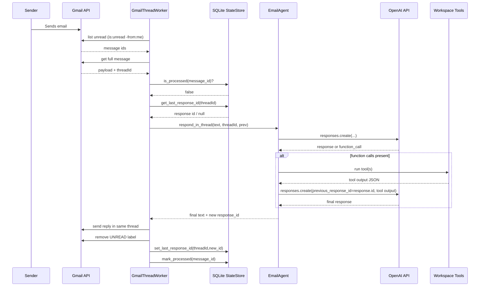
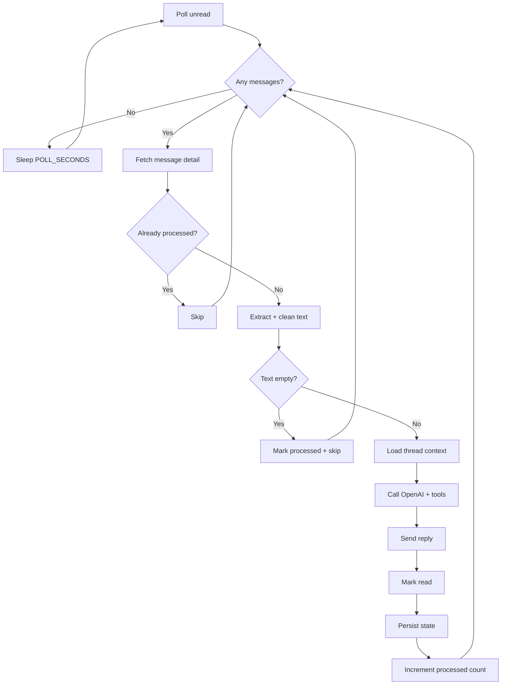
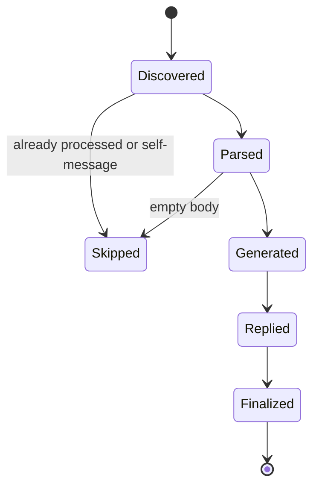

# Runtime and Pipeline

_Last verified against commit `7317103`._

## Stage-by-stage execution

| Stage | Module | Input | Output |
|---|---|---|---|
| 0. Startup | `app/main.py` | env + files | initialized worker and clients |
| 1. Poll | `GmailThreadWorker.process_once` | Gmail query | list of unread messages |
| 2. Fetch detail | `gmail.users.messages.get` | message id | full message payload |
| 3. Normalize | `extract_plain_text`, `clean_reply_text` | Gmail payload | cleaned user text |
| 4. Restore context | `StateStore.get_last_response_id` | thread_id | prior response id or null |
| 5. Generate | `EmailAgent.respond_in_thread` | text + previous_response_id | response text + new response id |
| 6. Tool calls (optional) | `EmailAgent._run_tool` | model function calls | function_call_output payloads |
| 7. Send reply | `_send_reply` | to/subject/body/thread | Gmail sent message |
| 8. Mark processed | `modify UNREAD`, state methods | msg/thread IDs | deduped, thread pointer updated |

## Full run sequence

## Pipeline flow and checkpoints

## Failure points and current behavior

| Failure point | Current behavior | Retry strategy present? |
|---|---|---|
| Google OAuth missing/invalid at startup | startup fails | No explicit retry |
| Gmail list/get/send API error | exception bubbles and can break worker loop call | No |
| OpenAI API error | exception bubbles | No |
| Tool call arg parse (`json.loads`) error | exception bubbles | No |
| SQLite transient error | exception bubbles | No |

## Checkpoints

Current explicit checkpoints:
- message-level dedupe via `processed_messages`
- thread memory pointer via `thread_state`

No queue checkpoints and no dead-letter handling exist yet.

## Job lifecycle (message-level)

