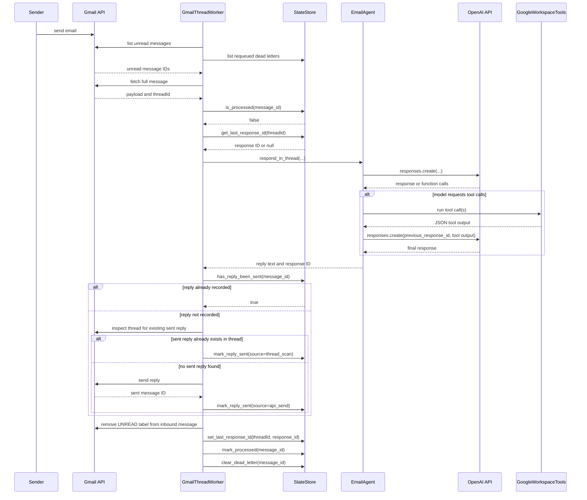
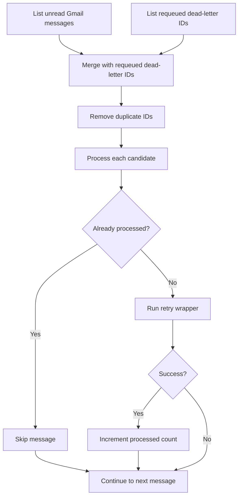
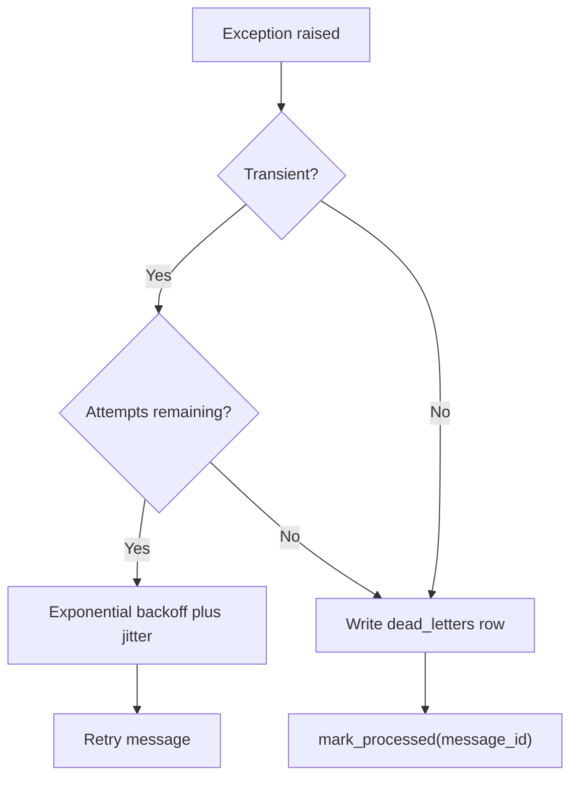
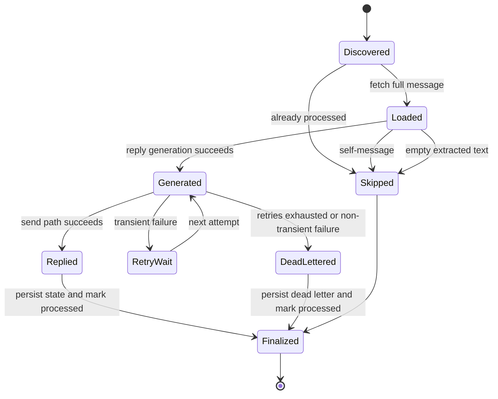

# Runtime And Pipeline

_Last verified against commit `b09c4f1`._

This document follows the actual message-processing flow implemented in `app/gmail_worker.py`, `app/ai_agent.py`, and `app/state.py`.

## Stage-By-Stage Execution

| Stage | Code path | Input | Output |
|---|---|---|---|
| 0. Startup | `app.main.startup()` | env vars, prompt file, OAuth files | initialized services, state store, agent, and worker thread |
| 1. Build candidate set | `GmailThreadWorker.process_once()` | Gmail query plus requeued dead letters | ordered list of candidate message IDs |
| 2. Fetch message | `users.messages.get(..., format="full")` | Gmail message ID | full Gmail message payload |
| 3. Early exits and normalization | `_message_headers()`, `extract_plain_text()`, `clean_reply_text()` | Gmail payload | cleaned plain-text user input or skip |
| 4. Restore thread context | `StateStore.get_last_response_id()` | Gmail `threadId` | previous OpenAI response ID or `None` |
| 5. Generate reply | `EmailAgent.respond_in_thread()` | cleaned input, email metadata, previous response ID | final reply text and new response ID |
| 6. Execute model tool loop | `EmailAgent._run_tool()` | function calls emitted by the model | tool outputs fed back into the model |
| 7. Send with idempotency guard | `_send_with_idempotency_guard()` | inbound message ID, reply body, thread metadata | existing sent reply record or new Gmail send |
| 8. Finalize success path | Gmail `modify()` plus state writes | message ID and thread ID | message marked read, thread pointer updated, processed recorded |
| 9. Retry or dead-letter | `_process_message_with_retry()` | raised exception | retry with backoff or terminal dead-letter record |

## Full Run Sequence

## Candidate Selection And Processing Flow

`process_once()` does not only look at unread Gmail messages. It also pulls `requeued` dead-letter message IDs from SQLite so an operator can replay a message even if it is no longer unread.

## Success Path Details

The worker considers a message successfully processed when:

1. it fetches and parses the Gmail payload,
2. it obtains a final reply from the agent,
3. it passes the send idempotency guard,
4. it removes the `UNREAD` label from the inbound message,
5. it updates `thread_state`,
6. it records the message in `processed_messages`,
7. it clears any stale `dead_letters` row for that message.

Messages skipped because they are self-originated or empty are also marked processed, but they do not increment the success counter returned by `/process-now`.

## Retry Logic

Transient failure handling is implemented entirely inside `GmailThreadWorker._process_message_with_retry()`.

- Retry count: `RETRY_MAX_ATTEMPTS`
- Base delay: `RETRY_BASE_DELAY_MS`
- Max delay: `RETRY_MAX_DELAY_MS`
- Jitter: `RETRY_JITTER_MS`

Transient classification sources:
- Google `HttpError` status in `{408, 409, 425, 429, 500, 502, 503, 504}`
- exception attribute `status_code` in the same set
- exception class names containing tokens such as `timeout`, `ratelimit`, `connection`, `temporar`, or `internalserver`

## Failure Points And Actual Behavior

| Failure point | Current behavior | Retry? |
|---|---|---|
| Missing or invalid Google credentials at startup | app startup fails before worker thread begins | No |
| Gmail unread list call fails | prints error and returns zero processed for that cycle | Natural retry on next poll |
| Gmail full-message fetch fails | message run enters retry wrapper | Yes |
| OpenAI Responses API call fails | message run enters retry wrapper | Yes |
| Tool argument JSON parsing fails | treated as terminal error and dead-lettered | No |
| Tool execution fails | depends on thrown exception classification | Usually yes if transient |
| Gmail thread scan for prior sent reply fails | ignored, worker falls back to send attempt | No separate retry |
| Gmail send or label-modify fails | message run enters retry wrapper | Yes |
| SQLite read or write fails during message run | message run fails and usually dead-letters | Partial |

## Explicit Checkpoints

Current checkpointing mechanisms:

- `processed_messages`: inbound message dedupe
- `thread_state`: conversation continuity pointer
- `dead_letters`: failed message tracking and replay queue
- `outbound_replies`: outbound send idempotency tracking

Important behaviors:

- Dead-lettered messages are marked processed to avoid infinite retry loops.
- Requeueing a dead-letter row changes its status to `requeued` and removes the processed-message dedupe row.
- Successful replay deletes the dead-letter row again.

## Job Lifecycle

