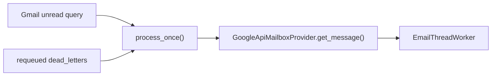
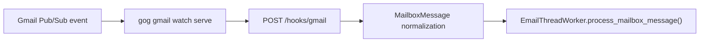
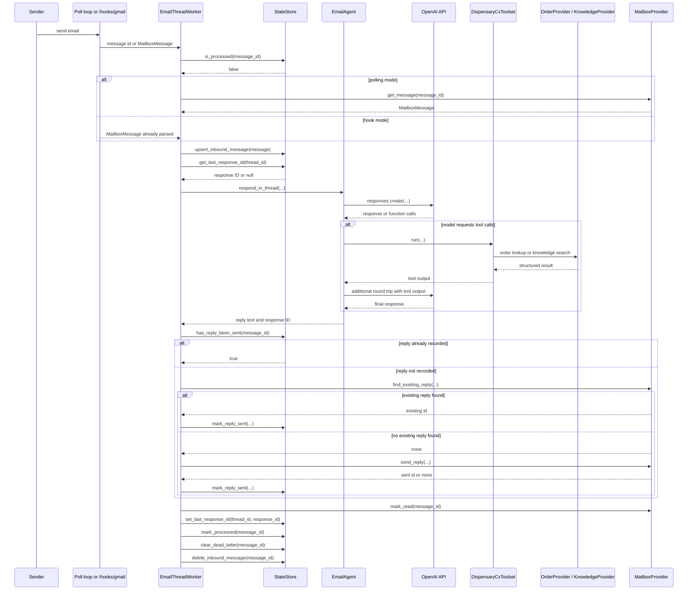

# Runtime And Pipeline

This document follows the actual message-processing flow implemented in `app/main.py`, `app/gmail_worker.py`, `app/mailbox.py`, `app/cx_toolset.py`, `app/cx_providers.py`, and `app/state.py`.

## Stage-By-Stage Execution

| Stage | Code path | Input | Output |
|---|---|---|---|
| 0. Startup | `app.main.startup()` | env vars, prompt file, provider-specific auth material | initialized state store, mailbox provider, toolset, order provider, knowledge provider, and optional watcher or poll thread |
| 1. Ingress | polling or hook path | unread Gmail IDs plus requeued IDs, or `/hooks/gmail` payload | candidate message IDs or `MailboxMessage` objects |
| 2. Snapshot inbound message | `_load_message()` or `process_mailbox_message()` | provider message or hook payload | `inbound_messages` row for retry/replay |
| 3. Early exits and normalization | `clean_reply_text()` | normalized body text | cleaned user input or skip |
| 4. Restore thread context | `StateStore.get_last_response_id()` | thread ID | previous OpenAI response ID or `None` |
| 5. Generate reply | `EmailAgent.respond_in_thread()` | cleaned input, email metadata, previous response ID | final reply text and new response ID |
| 6. Execute CX tool loop | `DispensaryCxToolset.run()` | function calls emitted by the model | order or store-knowledge payloads fed back into the model |
| 7. Send with idempotency guard | `_send_with_idempotency_guard()` | inbound message ID, reply body, thread metadata | existing sent reply record or new outbound send |
| 8. Finalize success path | provider mark-read plus state writes | message ID and thread ID | message marked processed, thread pointer updated, dead letter cleared |
| 9. Retry or dead-letter | `_process_message_with_retry()` | raised exception | retry with backoff or terminal dead-letter record |

## Tool Surface

The model can call exactly two functions:

- `lookup_order`
- `search_store_knowledge`

`lookup_order` is backed by the configured `OrderProvider`.
`search_store_knowledge` is backed by the configured `KnowledgeProvider`.

## Ingress Paths

### `google_api` polling mode

### `gog` hook mode

## Full Run Sequence

## Candidate Selection And Processing Flow

`process_once()` is only used in `google_api` mode. It merges unread Gmail message IDs with any `requeued` dead-letter IDs so operators can replay a message even if it is no longer unread.

## Success Path Details

The worker considers a message successfully processed when it:

1. loads or receives a normalized inbound message,
2. gets a final reply from the agent,
3. passes the send idempotency guard,
4. marks the message processed,
5. updates `thread_state`,
6. clears any stale dead-letter row,
7. deletes the `inbound_messages` snapshot.

Messages skipped because they are self-originated, outside the sender policy, or empty are also marked processed, and their inbound snapshot is deleted.

## Retry Logic

Transient failure handling is implemented inside `EmailThreadWorker._process_message_with_retry()`.

- Retry count: `RETRY_MAX_ATTEMPTS`
- Base delay: `RETRY_BASE_DELAY_MS`
- Max delay: `RETRY_MAX_DELAY_MS`
- Jitter: `RETRY_JITTER_MS`

Transient classification sources:

- Google `HttpError` status in `{408, 409, 425, 429, 500, 502, 503, 504}`
- exception attribute `status_code` in the same set
- exception class names containing tokens such as `timeout`, `ratelimit`, `connection`, `temporar`, or `internalserver`

Provider-specific note:

- `ProviderAPIError` from the order provider participates in the same retry classification via its `status_code`

## Failure Points And Actual Behavior

| Failure point | Current behavior | Retry? |
|---|---|---|
| missing or invalid provider setup at startup | app startup fails before worker begins | No |
| Gmail unread list call fails in polling mode | logs and returns zero processed for that cycle | Natural retry on next poll |
| `gog gmail watch start` fails | startup fails in `gog` mode | No |
| `gog gmail watch serve` exits | watcher manager restarts it after 2 seconds | Internal restart |
| invalid `/hooks/gmail` auth token | request is rejected with `401` | Caller must retry with valid token |
| provider message load fails | message run enters retry wrapper | Yes |
| OpenAI Responses API call fails | message run enters retry wrapper | Yes |
| tool argument JSON parsing fails | terminal error and dead-letter | No |
| order-provider API failure | message run enters retry wrapper when classified transient | Sometimes |
| outbound send fails | message run enters retry wrapper | Yes |
| state write fails during message run | message run fails and usually dead-letters | Partial |
