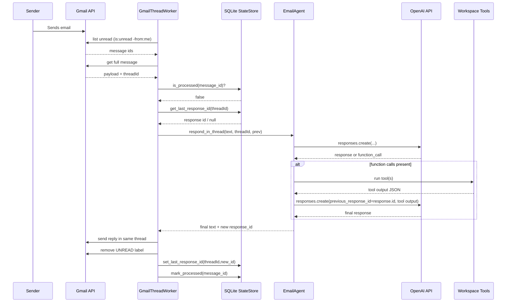
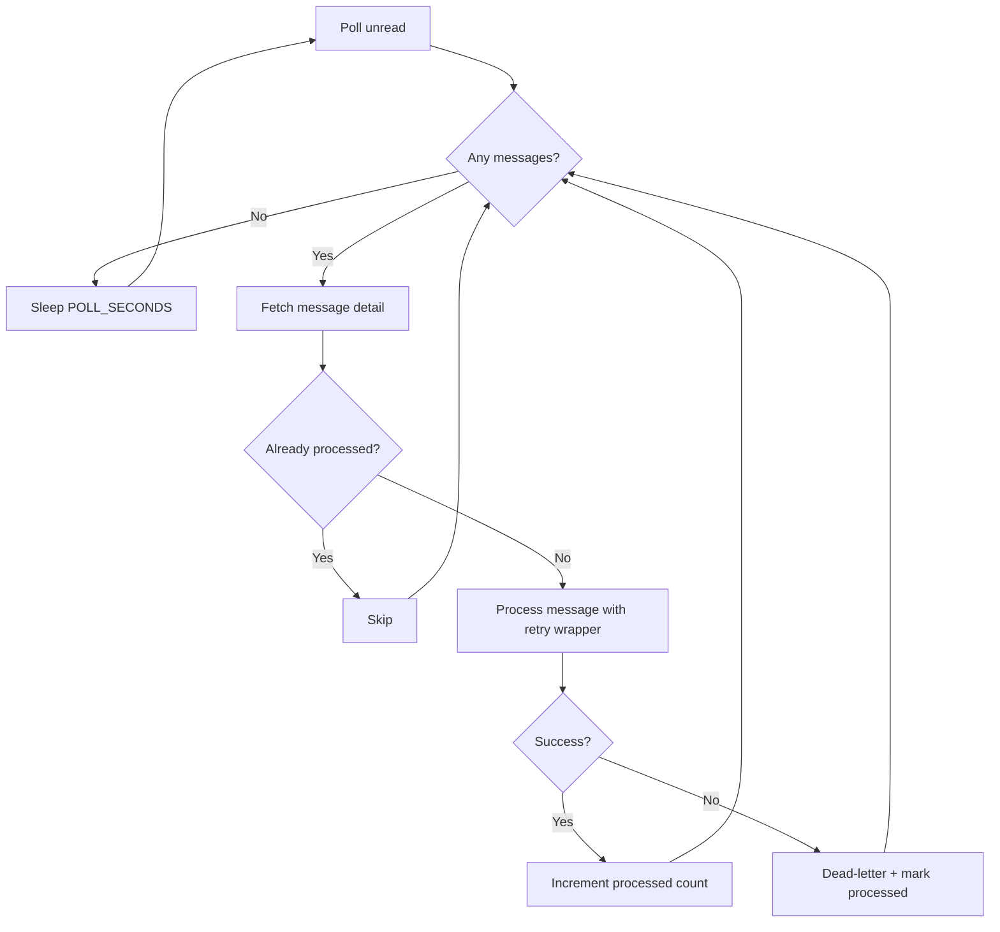
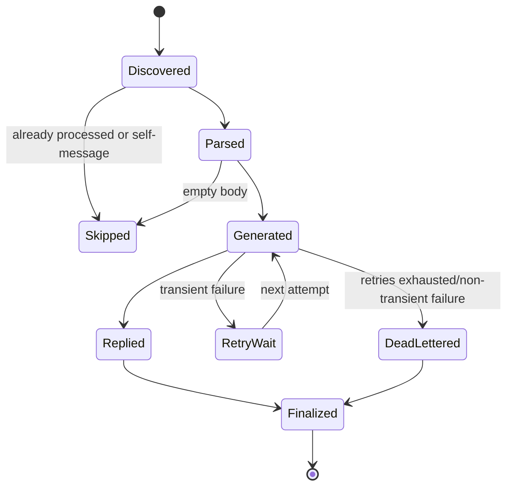

# Runtime and Pipeline

_Last verified against commit `7317103`._

## Stage-by-stage execution

| Stage | Module | Input | Output |
|---|---|---|---|
| 0. Startup | `app/main.py` | env + files | initialized worker and clients |
| 1. Poll | `GmailThreadWorker.process_once` | Gmail query | list of unread messages |
| 2. Fetch detail | `gmail.users.messages.get` | message id | full message payload |
| 3. Normalize | `extract_plain_text`, `clean_reply_text` | Gmail payload | cleaned user text |
| 4. Restore context | `StateStore.get_last_response_id` | thread_id | prior response id or null |
| 5. Generate | `EmailAgent.respond_in_thread` | text + previous_response_id | response text + new response id |
| 6. Tool calls (optional) | `EmailAgent._run_tool` | model function calls | function_call_output payloads |
| 7. Send reply | `_send_reply` | to/subject/body/thread | Gmail sent message |
| 8. Mark processed | `modify UNREAD`, state methods | msg/thread IDs | deduped, thread pointer updated |
| 9. Retry/dead-letter | `GmailThreadWorker._process_message_with_retry` | raised exception | retries with backoff, then dead-letter persistence |

## Full run sequence

## Pipeline flow and checkpoints

## Failure points and current behavior

| Failure point | Current behavior | Retry strategy present? |
|---|---|---|
| Google OAuth missing/invalid at startup | startup fails | No explicit retry |
| Gmail list API error | logged and cycle returns without crash | No (next poll cycle retries naturally) |
| Gmail get/send/modify API error (per message) | retried with exponential backoff | Yes (bounded by `RETRY_MAX_ATTEMPTS`) |
| OpenAI API error (per message) | retried with exponential backoff for transient classes; dead-letter on exhaustion/non-transient | Yes |
| Tool call arg parse (`json.loads`) error | treated as non-transient; message moved to dead-letter | No |
| SQLite write/read error (per message) | may fail message run, then dead-letter path captures where possible | Partial |

## Checkpoints

Current explicit checkpoints:
- message-level dedupe via `processed_messages`
- thread memory pointer via `thread_state`
- dead-letter persistence via `dead_letters`

Dead-letter messages are intentionally marked processed to prevent retry loops.
Operators can explicitly requeue via `POST /dead-letter/requeue/{message_id}`.

## Job lifecycle (message-level)

