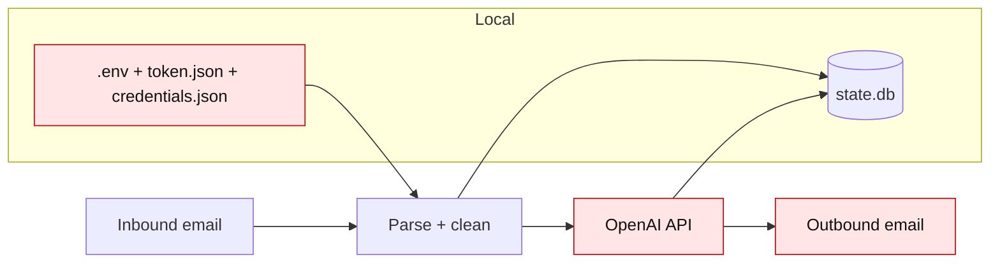

# Security and Safety

_Last verified against commit `7317103`._

## Secrets and auth model

Configured via `.env` (`app/settings.py`):
- `OPENAI_API_KEY`
- file paths for Google credentials/token

Google auth (`app/google_clients.py`):
- OAuth Desktop flow
- token persisted to `token.json`
- refresh supported when refresh token exists

Current scopes (broad):
- `https://mail.google.com/`
- `https://www.googleapis.com/auth/drive`
- `https://www.googleapis.com/auth/documents`

## Data handling rules (actual behavior)

- Inbound email content is sent to OpenAI as prompt input.
- Agent output is sent back by Gmail API in-thread.
- Thread memory pointers and processed IDs are stored in local SQLite.
- No encryption-at-rest beyond OS defaults is implemented.

## Safety boundaries in current code

Implemented:
- ignores self-messages to reduce loop risk
- dedupes processed message IDs
- strips common quoted-reply blocks before model call

Not implemented (important):
- recipient allowlist
- approval gate before outbound send
- DLP/PII filtering
- per-sender policy controls

## Risk boundary diagram

## Safe defaults for local testing

- use a dedicated Gmail mailbox only
- keep account scope narrow operationally (dedicated Drive folder)
- do not run against high-risk inboxes
- keep `.env`, `token.json`, `credentials.json`, `state.db` out of git

## Recommended hardening roadmap

1. Add sender allowlist/denylist
2. Add “approval required before send” mode
3. Add outbound rate limiting
4. Add structured audit logs (message/thread IDs)
5. Reduce OAuth scopes where possible
6. Move secrets to managed secret store for server deployment
