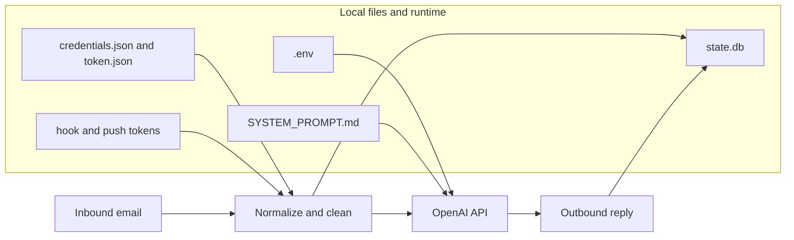
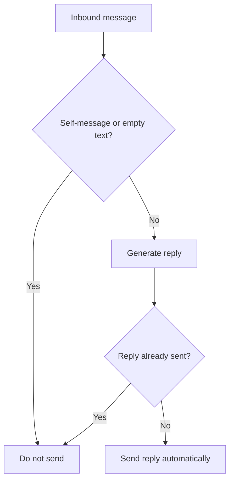

# Security And Safety

_Last verified against commit `b6c46e6`._

This document describes the security posture of the code as it exists today. It does not describe future controls that are not implemented.

## Secrets And Auth Model

| Asset | Source | Used by | Current risk if compromised |
|---|---|---|---|
| `OPENAI_API_KEY` | `.env` | `app/ai_agent.py` | model access and billable API usage |
| `credentials.json` | local file | `app/google_clients.py` | bootstrap access to Gmail, Drive, and Docs in `google_api` mode |
| `token.json` | local file | `app/google_clients.py` | ongoing mailbox and Workspace access in `google_api` mode |
| `GOG_GMAIL_HOOK_TOKEN` | `.env` | `app/main.py` | unauthorized callers could inject fake `/hooks/gmail` events |
| `GOG_GMAIL_PUSH_TOKEN` | `.env` | `app/gog_watcher.py` | unauthorized callers could reach the local `gog` watch-serve endpoint |
| `state.db` | local file | `app/state.py`, `app/gmail_worker.py` | thread pointers, message metadata, dead-letter details, send-tracking metadata, cached message bodies |
| `SYSTEM_PROMPT.md` | local file | `app/ai_agent.py` | changes model behavior on restart |

Provider notes:
- `google_api` uses the OAuth desktop flow and local token files.
- `gog` mode delegates Google account auth to the external `gog` CLI. Mailroom still owns the hook and push tokens in `.env`.

Current Google scopes in Mailroom itself are broad in `google_api` mode:
- `https://mail.google.com/`
- `https://www.googleapis.com/auth/drive`
- `https://www.googleapis.com/auth/documents`

## What The Model Can And Cannot Control

| Concern | Controlled by | Notes |
|---|---|---|
| recipient address | application | parsed from the inbound `From` header |
| reply thread | application | set from the inbound thread ID |
| reply body | model | generated through `EmailAgent.respond_in_thread()` |
| tool calls | model within application-defined limits | tool surface changes by provider |
| Gmail reads and sends | application or external `gog` transport | the model has no direct Gmail tool |

This means the model cannot choose an arbitrary recipient or browse the inbox directly, but it can decide the actual body text that gets sent back to the original sender.

## Approval Model

There is no manual approval gate in the current code.

Current send decision path:

1. inbound message is loaded or received through a hook,
2. model generates reply text,
3. worker sends reply automatically if the send idempotency guard does not detect that it already sent one.

Current safeguards before send:
- self-message skip
- empty-body skip
- inbound dedupe via `processed_messages`
- outbound dedupe via `outbound_replies`
- best-effort thread scan in `google_api` mode

Missing safeguards:
- human review or approval
- sender allowlist or denylist
- outbound content filtering
- per-sender policy rules
- rate limiting

## Data Handling Rules

### Data sent to OpenAI

The application sends:
- cleaned email body text
- `From`
- `Subject`
- thread ID
- previous OpenAI `response.id` chain
- tool outputs when the model calls tools

If the model calls Drive or Docs tools in `google_api` mode, their outputs are also provided back to the model.

### Data stored locally

The application stores:
- thread IDs
- OpenAI response IDs
- inbound message IDs
- dead-letter metadata such as sender, subject, error, attempts
- outbound sent-message tracking metadata
- cached inbound message snapshots in `inbound_messages`

Important current behavior:
- `inbound_messages.body_text` stores normalized inbound body text temporarily
- successful and skipped messages delete that snapshot
- terminal failures can leave the cached body in SQLite until replay or cleanup

### Data sent back out

The application sends the model-generated reply body back to the original sender:
- through Gmail API in `google_api` mode
- through `gog gmail send` in `gog` mode

## Trust Boundary Diagram

## Current Safety Boundary

## Safe Defaults For Local Use

- use a dedicated mailbox
- keep `.env`, `state.db`, and prompt files out of git
- keep `credentials.json` and `token.json` out of git in `google_api` mode
- avoid sensitive or regulated inboxes
- run only one active instance against the mailbox

Additional `gog` safety notes:
- treat the hook token like a shared secret
- do not expose the hook endpoint publicly without access control
- assume the public push path is part of your trust boundary

## Known Security Gaps

- broad Google OAuth scopes in `google_api` mode
- no manual approval gate
- no sender policy layer
- no encryption-at-rest beyond host defaults
- no audit log beyond stdout and SQLite metadata
- no DLP or PII redaction layer
- cached inbound body text can persist in SQLite after failures

## Recommended Hardening Roadmap

1. Add sender allowlist and denylist controls.
2. Add an approval-required mode before outbound send.
3. Add structured audit logs with message and thread IDs.
4. Reduce Google scopes where practical.
5. Add explicit cleanup policy for stale `inbound_messages`.
6. Move secrets and token material into a managed secret strategy for server deployments.
