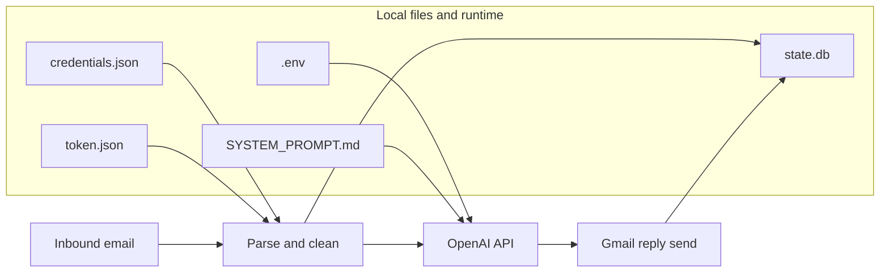
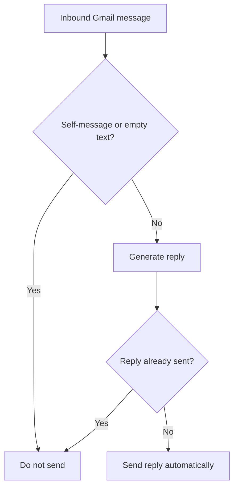

# Security And Safety

_Last verified against commit `b09c4f1`._

This document describes the security posture of the code as it exists today. It does not describe future controls that are not implemented.

## Secrets And Auth Model

| Asset | Source | Used by | Current risk if compromised |
|---|---|---|---|
| `OPENAI_API_KEY` | `.env` | `app/ai_agent.py` | model access and billable API usage |
| `credentials.json` | local file | `app/google_clients.py` | bootstrap access to Gmail, Drive, and Docs |
| `token.json` | local file | `app/google_clients.py` | ongoing mailbox and Workspace access |
| `state.db` | local file | `app/state.py`, `app/gmail_worker.py` | message metadata, thread pointers, dead-letter details, send-tracking metadata |
| `SYSTEM_PROMPT.md` | local file | `app/ai_agent.py` | changes model behavior on restart |

Google auth behavior:
- uses the OAuth desktop flow
- reads and writes a local token file
- refreshes tokens when a refresh token is present

Current Google scopes are broad:
- `https://mail.google.com/`
- `https://www.googleapis.com/auth/drive`
- `https://www.googleapis.com/auth/documents`

## What The Model Can And Cannot Control

| Concern | Controlled by | Notes |
|---|---|---|
| recipient address | application | parsed from the inbound `From` header |
| reply thread | application | set from the inbound Gmail `threadId` |
| subject line shape | application | original subject, with `Re:` prefix if needed |
| reply body | model | generated through `EmailAgent.respond_in_thread()` |
| tool calls | model within application-defined limits | only the hardcoded tool list is exposed |
| Gmail reads and sends | application | the model has no direct Gmail tool |

This means the model cannot choose an arbitrary recipient or browse the inbox directly, but it can decide the actual body text that gets sent back to the original sender.

## Approval Model

There is no manual approval gate in the current code.

Current send decision path:

1. inbound message is fetched and cleaned,
2. model generates reply text,
3. worker sends reply automatically if the send idempotency guard does not detect that it already sent one.

Current safeguards before send:
- self-message skip
- empty-body skip
- inbound dedupe via `processed_messages`
- outbound dedupe via `outbound_replies` plus a best-effort Gmail thread scan

Missing safeguards:
- human review or approval
- sender allowlist or denylist
- outbound content filtering
- per-sender policy rules
- rate limiting

## Data Handling Rules

### Data sent to OpenAI

The application sends:
- cleaned email body text
- `From`
- `Subject`
- Gmail `threadId`
- previous OpenAI `response.id` chain
- tool outputs when the model calls tools

If the model calls `read_google_doc`, the returned Google Doc text is also provided back to the model in the tool output.

### Data stored locally

The application stores:
- Gmail thread IDs
- OpenAI response IDs
- inbound Gmail message IDs
- dead-letter metadata such as sender, subject, error, attempts
- outbound sent-message tracking metadata

The application does not persist full inbound email bodies to SQLite.

### Data sent back out

The application sends the model-generated reply body back through the Gmail API to the original sender in the same thread.

## Trust Boundary Diagram

## Current Safety Boundary

## Safe Defaults For Local Use

- use a dedicated Gmail mailbox
- use a dedicated Google Drive folder where possible
- keep `.env`, `credentials.json`, `token.json`, and `state.db` out of git
- avoid sensitive or regulated inboxes
- run only one active instance against the mailbox

## Known Security Gaps

- broad Google OAuth scopes
- no manual approval gate
- no sender policy layer
- no encryption-at-rest beyond host defaults
- no audit log beyond coarse stdout and SQLite metadata
- no DLP or PII redaction layer

## Recommended Hardening Roadmap

1. Add sender allowlist and denylist controls.
2. Add an approval-required mode before Gmail send.
3. Add outbound rate limiting.
4. Add structured audit logs with message and thread IDs.
5. Reduce Google scopes where practical.
6. Move secrets and token material into a managed secret strategy for server deployments.
