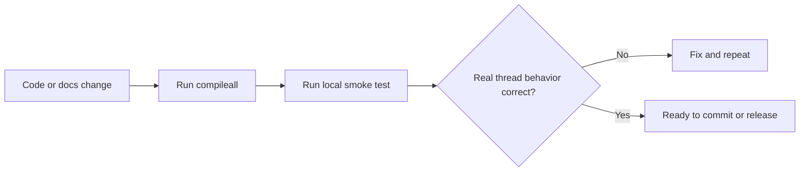

# Testing And Quality

_Last verified against commit `b09c4f1`._

## Current Quality Strategy

There is no automated test suite in the repository today. The current quality bar is:

- Python import and syntax validation through `compileall`
- manual bring-up with real credentials
- manual end-to-end mailbox testing
- a basic GitHub Actions compile check

This is sufficient for a local MVP, not for high-confidence production changes.

## Current Coverage

| Area | Current coverage | How it is validated today |
|---|---|---|
| package import and syntax | minimal automated | `python -m compileall app scripts` and CI |
| startup wiring | manual | `make run` plus `/healthz` |
| Gmail worker behavior | manual | real mailbox testing |
| OpenAI reply generation | manual | send a test email and inspect the reply |
| Drive and Docs tool paths | manual | prompt the agent to use those tools |
| SQLite state behavior | manual | inspect `state.db` and endpoint behavior |
| retry and dead-letter behavior | partial manual | provoke failures and inspect `/dead-letter` |

## What Is Not Covered

- unit tests for parsing helpers
- unit tests for `StateStore`
- mocked integration tests for Gmail, Drive, Docs, and OpenAI
- contract tests for tool schema and tool handler consistency
- regression tests for retry classification
- performance or load testing

## Current Automated Check

GitHub Actions currently runs:

```bash
python -m compileall app scripts
```

That validates importability and syntax only.

## How To Run Current Quality Checks

### Compile Check

```bash
source .venv/bin/activate
python -m compileall app scripts
```

### Smoke Run

```bash
make setup
make auth
make run
curl http://127.0.0.1:8787/healthz
curl -X POST http://127.0.0.1:8787/process-now
```

### Functional Manual Checks

Verify all of the following against a real mailbox:

- the app starts successfully
- `/healthz` reports `worker_alive=true`
- a new email receives a reply
- a second reply in the same Gmail thread preserves continuity
- a prompt that requests Drive or Docs work actually uses the tool path successfully
- dead-letter inspection and requeue work as expected

## Recommended First Automated Tests

### Unit Tests

- `clean_reply_text()`
- `extract_plain_text()`
- `StateStore` read and write semantics
- retry delay calculation and transient error classification

### Mocked Integration Tests

- happy-path `GmailThreadWorker._process_message_once()`
- skip behavior for self-messages and empty messages
- send idempotency guard behavior
- dead-letter replay flow
- `EmailAgent` tool loop with fake OpenAI responses

### Contract Tests

- every tool in `_tool_specs()` maps to an executable handler
- API endpoints return documented fields

## Release Readiness Checklist

- [ ] `.env.example` matches the runtime configuration surface in `app/settings.py`
- [ ] README quickstart works on a fresh machine
- [ ] `make auth` succeeds with a fresh `credentials.json`
- [ ] `make run` starts and `/healthz` reports `worker_alive=true`
- [ ] at least one end-to-end email thread has been verified
- [ ] dead-letter inspect and requeue flow has been exercised
- [ ] no secrets or tokens are committed
- [ ] docs were updated for any runtime behavior change

## Quality Gate Model



## Practical Next Step

The highest-value next investment is a small mocked test suite around:

1. `StateStore`
2. `GmailThreadWorker`
3. `EmailAgent` tool loop

Those three areas cover most of the repo's behavioral risk.
