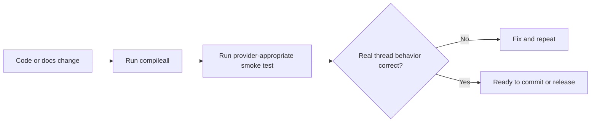

# Testing And Quality

_Last verified against commit `b6c46e6`._

## Current Quality Strategy

There is still no automated behavioral test suite in the repository today. The current quality bar is:

- Python import and syntax validation through `compileall`
- manual bring-up with real credentials
- manual end-to-end mailbox testing
- a basic GitHub Actions compile check

This is sufficient for an MVP, not for high-confidence production changes.

## Current Coverage

| Area | Current coverage | How it is validated today |
|---|---|---|
| package import and syntax | minimal automated | `python3.11 -m compileall app scripts` and CI |
| startup wiring | manual | `mailroom run` plus `/healthz` |
| mailbox abstraction | manual | smoke run in both provider modes |
| polling worker behavior | manual | real mailbox testing in `google_api` mode |
| hook ingress behavior | partial manual | `/hooks/gmail` testing in `gog` mode |
| OpenAI reply generation | manual | send a test email and inspect the reply |
| Drive and Docs tool paths | manual | prompt the agent to use those tools in `google_api` mode |
| SQLite state behavior | manual | inspect `state.db` and endpoint behavior |
| retry and dead-letter behavior | partial manual | provoke failures and inspect `/dead-letter` |

## What Is Not Covered

- unit tests for parsing helpers
- unit tests for `StateStore`
- unit tests for the mailbox providers
- mocked integration tests for Gmail, `gog`, Drive, Docs, and OpenAI
- regression tests for retry classification
- tests for watcher restart or renewal behavior
- performance or load testing

## Current Automated Check

GitHub Actions currently runs:

```bash
python -m compileall app scripts
```

That validates importability and syntax only.

## How To Run Current Quality Checks

### Compile Check

```bash
source .venv/bin/activate
python3.11 -m compileall app scripts
```

### Smoke Run: `google_api`

```bash
make setup
source .venv/bin/activate
mailroom setup
mailroom doctor
mailroom run --reload
curl http://127.0.0.1:8787/healthz
curl -X POST http://127.0.0.1:8787/process-now
```

### Smoke Run: `gog`

```bash
make setup
source .venv/bin/activate
mailroom connections
mailroom doctor
mailroom run --reload
curl http://127.0.0.1:8787/healthz
```

Then test the hook path:

```bash
curl -X POST http://127.0.0.1:8787/hooks/gmail \
  -H "Authorization: Bearer <GOG_GMAIL_HOOK_TOKEN>" \
  -H "Content-Type: application/json" \
  -d '{"messages":[{"id":"test-1","threadId":"thread-1","from":"human@example.com","subject":"Hello","body":"Hi"}]}'
```

## Functional Manual Checks

Verify all of the following against a real mailbox:

- the app starts successfully
- `/healthz` reports the expected provider and ingress mode
- a new email receives a reply
- a second reply in the same thread preserves continuity
- Drive and Docs tool requests work in `google_api` mode
- dead-letter inspection and requeue work as expected

## Recommended First Automated Tests

### Unit Tests

- `clean_reply_text()`
- `extract_plain_text()`
- `StateStore` read and write semantics
- retry delay calculation and transient error classification
- hook payload normalization in `app/main.py`

### Mocked Integration Tests

- happy-path `EmailThreadWorker._process_loaded_message()`
- skip behavior for self-messages and empty messages
- send idempotency guard behavior
- dead-letter replay flow
- watcher manager command construction and restart handling
- `EmailAgent` tool loop with fake OpenAI responses

### Contract Tests

- every tool in `_tool_specs()` maps to an executable handler
- API endpoints return documented fields
- `MAIL_PROVIDER` branches instantiate the expected provider and watcher behavior

## Release Readiness Checklist

- [ ] `.env.example` matches the runtime configuration surface in `app/settings.py`
- [ ] README quickstart works on a fresh machine
- [ ] `mailroom setup` succeeds for the chosen provider
- [ ] `mailroom doctor` passes for the chosen provider
- [ ] `mailroom run` starts and `/healthz` reports the expected mode
- [ ] at least one end-to-end email thread has been verified
- [ ] dead-letter inspect and requeue flow has been exercised
- [ ] no secrets or tokens are committed
- [ ] docs were updated for any runtime behavior change

## Quality Gate Model



## Practical Next Step

The highest-value next investment is a small mocked test suite around:

1. `StateStore`
2. `EmailThreadWorker`
3. provider selection and hook ingress

Those areas now cover most of the repo's behavioral risk.
