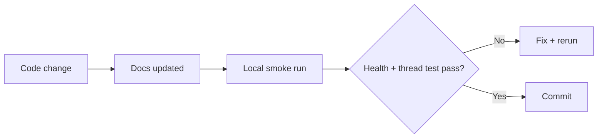

# Testing and Quality

_Last verified against commit `7317103`._

## Current test strategy

There is currently **no automated test suite** in repository. Quality assurance is manual + smoke-run based.

## What is covered today

- Python syntax/import health can be checked via `compileall`
- Runtime health endpoint verifies process + worker liveness
- End-to-end mailbox behavior is manually testable with real Gmail thread

## What is not covered today

- unit tests for parsing and state behavior
- integration tests for Gmail/Drive/Docs wrappers
- contract tests for OpenAI tool-call loop
- failure-injection tests
- performance/load testing

## Manual quality checks

```bash
# 1) install + run
make setup
make auth
make run

# 2) health
curl http://127.0.0.1:8787/healthz

# 3) force one cycle
curl -X POST http://127.0.0.1:8787/process-now
```

Functional checks:
- agent replies in same thread
- reply context carries across turns
- docs tool actions complete when requested by prompt

## Suggested automated test plan

1. **Unit tests**
   - `clean_reply_text`
   - `extract_plain_text`
   - `StateStore` read/write semantics
2. **Integration tests (mocked APIs)**
   - Gmail worker happy path
   - dedupe behavior
   - OpenAI function-call loop with fake responses
3. **Contract tests**
   - ensure tool schema names match executable handlers
4. **Operational tests**
   - startup with missing env/creds should fail clearly

## Release readiness checklist

- [ ] `.env.example` matches real required settings
- [ ] onboarding docs tested on fresh machine
- [ ] OAuth flow validated end-to-end
- [ ] health endpoint validated
- [ ] no secrets committed
- [ ] smoke run with at least 2-thread conversation verified
- [ ] incident rollback steps tested

## Quality gate model


